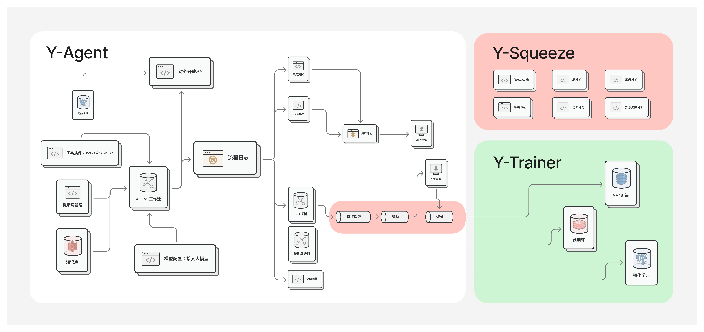

# 介绍
<Banner variant="rainbow">**Y-Agent Studio 是一个面向 `企业级应用` 的Agent开发套件**</Banner>

## 特点

Y-Agent 框架 完整开源，可商用，不区分社区版 商用版，下载后意味着您可以获得全部功能。

<Cards>
  <Card  icon={<GitCompareArrows className="text-purple-300" />}  title="有向有环图" >
  不同于传统的有向无环图 `DAG`，Y-Agent内部提供了有环图，可以满足复杂的多环任务设计。

  有向有环图，可以支持多角色讨论，自主选择任务执行路径的业务需求。
  </Card>
  <Card  icon={<Combine className="text-blue-300" />} title="Agent自动化测试" >
  自动化测试，包含了 `流程测试` `单元测试`：支持数据标注、流程标注，可以对设计好的流程进行迭代测试，也可以对流程里面的某个节点进行测试。

  同时配合 `测试计划` `测试报告` 功能，可进行自动化测试。
  </Card>
  <Card icon={<FolderPen className="text-green-300" />} title="语料收集与生产" >
  支持手工方式向语料集内添加语料，配合多模型生成界面，可以快速人工标注高质量语料。

  同时，可以通过自建流程，对日志进行分析，自动对问题节点生产语料，极大减少人工。
  </Card>
  <Card icon={<ChartNetwork  className="text-red-300" />} title="支持模型训练" >
  与传统SFT、DPO、PPO、GRPO等不同，本训练框架在专有任务上，可以有效的避免过拟合、幻觉和复读机问题，同时最大限度保留模型基础能力。
  </Card>
</Cards>

## 可以解决的问题

Y-Agent Studio旨在解决传统Agent开发中存在的两大核心痛点：

### 1.  代码修改调试困难
Agent上线之前要经过多次调整，其中包含智能体编排、提示词编写、效果测试等工作，针对这些困难，我们：
    - 提供`有向有环图` `提示词版本记录` `流程测试、单元测试` `流程日志` 几个核心功能，可以随心所欲的完成Agent搭建。
    - 支持 **流程搭建--debug--测试--语料生产--训练** 的完整生命周期管理，帮助您的Agent持续进化。
### 2. 模型训练不可控

Agent开发中，仅通过智能体编排和提示词工程，往往很难达到预期效果，本套件中提供了：
    - **语料收集** 模块：语料收集支持人工和自动化收集，解决语料生产困难，人工成本高的问题。
    - **模型训练** 框架：提供模型训练包含预训练、指令微调、强化学习，解决了模型训练不可控的问题。

> 值得一提的是，使用我们的训练框架可以有效的避免过拟合、幻觉和复读机问题，同时保留基础模型的原有能力。

## 系统架构图

## 包含以下几个软件

<include>./public/software.mdx</include>

## 概述

本框架专注于 **深入研究有效的Agent技术** ，提供强大专业的底层能力和定制化工具，而非简单的零代码/低代码平台。

因此：它 **不适合** 毫无基础的初学者，而是专为辅助具备一定开发经验的 **程序开发人员** 而设计。

### 心路历程

<Steps>
<Step>

去年`2024年`我们尝试使用市面上的Agent开发框架，发现有一些使用上的不便：

    *多智能体协作和流程编排困难、日志查看不直观、无法收集语料等*

</Step>
<Step>

于是设计了Y-Agent工作流平台:

    *模仿企业内部多角色协作机制，支持工作空间、自主工具选择、角色间对话、流程日志、测试训练等*

</Step>

<Step>

随着工作流构建，我们发现，仅靠提示词和工作流，模型无法妥善完成垂直领域任务

    *于是有了测试和训练模块，就是标注并生产语料的功能，包含手工和自动化两种方式。*

</Step>
<Step>

由于大部分垂直领域语料的特殊性，传统的SFT方法很容易过拟合

    *所以我们设计了新的预训练、SFT和强化学习方法，并集成到Y-Trainer框架里，
能够通过Y-Agent平台收集的语料，并无缝衔接，完成预训练指令微调和强化学习。*

</Step>
</Steps>

---

## Y-Agent Studio适合什么人或者组织？

适合企业级项目，尤其是垂直领域，需要以下功能的人群：

1、需要持续快速对工作流进行迭代，并自动化测试。

2、对模型进行微调训练才能满足业务需求，有语料生产和收集需求。

### 核心概念与必备基础知识

要高效使用 Y-Agent Studio，开发者需要具备以下基础知识：

*   **智能体编排相关**：了解Agent、RAG、ReAct等基本概念，会编写提示词。

*   **数据类型与JSON结构**：需要用户了解计算机编程的基本数据类型、以及JSON格式。

*   **模型调用**：要求理解如何通过API调用云端或本地部署的模型。熟悉常见的API调用方式、参数设置、提示词编写。

*   **Web API 开发与调用**：Agent需要与外部系统进行交互，这主要通过Web API实现。
要求了解RESTful API，并具备构建简单API**服务**(Provide)的能力，以供Agent调用或外部系统调用Agent。

*   **模型训练相关知识**：包括PT、SFT、RL等。

