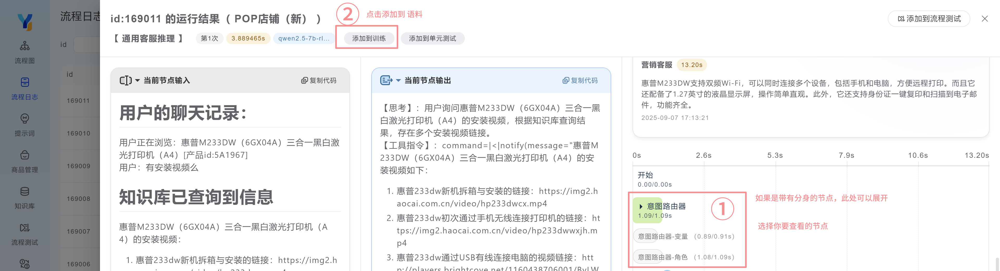
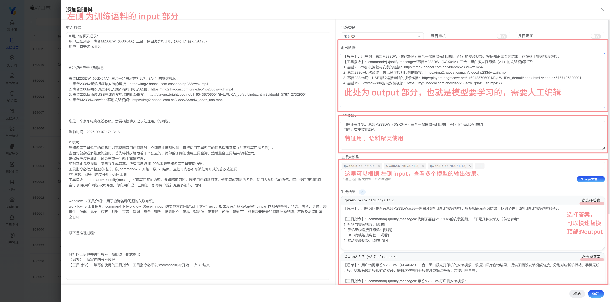

## 添加语料

### 1. 通过流程日志添加
首先在流程日志里，查看详情，找到有问题的大模型节点。点击该节点，按照下面流程添加。

第一步：

第二步：

特征概要的作用，是为了后续的语料自动化聚类使用。由于大多数语料重复度比较高，尤其是提示词部分，所以一般仅使用输入参数，例如 用户聊天记录，作为特征。

### 2. 手工添加语料

语料可以批量导入，也可以逐条添加。

批量导入的操作如下：

点击 下载导入模板 ，可以编辑添加要批量导入的内容，完成后，点击 导入 即可批量导入。

注意分类的名称，要按照已有的分类名称填写，特征概要需要填写的有区分度，以保证后续的自动化聚类效果。

## 修改语料

语料可以逐条编辑修改，点击条目后面修改按钮，进入修改界面。

同样，可以实现语料的批量修改，先选择一个分类，点击 导出，然后统一修改，再点击导入。

注意，不要修改导出数据中的ID，因为修改的内容是依靠ID来匹配的。

另外可以使用 调整类目功能，将语料从一个分类批量调整到另外一个分类。

## 最佳实践

添加语料

通常我们会先建好以下几个语料分类：问题改写、回复语气等

在日常查看流程日志的时候，当发现模型输出不符合预期的时候，先将有问题的节点，点击“添加语料”按钮，选择对应的分类，

然后仔细编辑好输出内容，

可以依靠 生成参考输出 功能辅助编辑（通常我们会使用不同的几个模型，生成参考输出）

最后将 是否更正 改为 “是”，点击确定。

语料管理员可以根据情况，定时对语料进行审核，或者重新修改。

待到需要训练的时候，将已更正和已审核的语料，导入到模型训练框架 Y-Training中。

高级用法：[自动化添加语料](/docs/y-agent/demo/auto-add-training-data) 