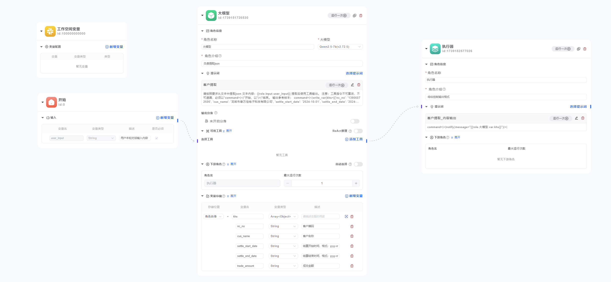

<Accordions>
  <Accordion id="faq-rerank" title="如何使用ReRank模型？">
    本系统不支持使用ReRank（重排序）功能，主要原因是：

    ReRank只能提供top-k文档，但是依然无法准确的筛选出需要的文档，这样还是会引入文档噪声，误导模型的回答。

    正确的方式是，再embbeding召回的文档中，再次通过模型进行判断，只选出对回答问题有用的文档。
  </Accordion>
  <Accordion  title="如何编写大模型的system提示词？">
    本系统不支持system提示词编写功能，主要原因是：

    实际使用的时候，system提示词可以直接写在提示内，效果上和单独设置没有什么区别。
  </Accordion>
  
  <Accordion id="faq-model-json" title="如何在流程结束后输出json而不是纯文本？">
简单的json，可以由模型直接使用 notify 工具输出。

复杂的json建议通过模型输出参数，在然后接一个执行器节点。通过notify工具进行转换。

  </Accordion>

  <Accordion title="为什么没有联网搜索工具？">
  建议使用在线模型的联网搜索功能，因为主流的在线模型API都提供联网搜素+总结功能，
  比起自己搭建一个网页分析流程，省时省力效果还好。

  当软也可以通过手动添加 WebAPI工具，自己集成搜索引擎提供的搜索API，实现联网搜索功能。
  </Accordion>

  
  <Accordion title="获取多个上游节点的输出？">
  可以使用`get_roles_outputs`函数获取多个角色的输出。
  ```js
  {{role.get_roles_outputs(['角色1','角色2','角色3'])}}
  ```
  get_roles_outputs：同时取多个角色的输出，并合并到一个数组中，field_key为要提取的字段名称，可以留空，留空时默认提取output字段。
  </Accordion>

  
  <Accordion  title="使用大模型的流式输出？">
  由于模型使用工具的机制是完整输出后，再解析，所有目前不支持流式输出。
  
  </Accordion>
  
  <Accordion  title="如何获取分批处理内的角色名称？">
  分批处理内的角色是按照一定格式拼写的，可以通过以下方式获取角色名称：
  ```python
  command=|<|assignment(next_roles=[{"role":"角色名_batch_{{batch.index}}","message":"做点什么"}])|>|
  ```
  其中`角色名_batch_{{batch.index}}`即为角色名称。
  </Accordion>

  <Accordion  title="如果模型输出command指令格式总是错误，怎么办？">
  有时候模型经常会遗漏 `command=|<|` 和 `|>|` 导致格式错误，导致指令无法解析。

  例如：输出 `command=|` `||` 等情况。

  碰到这种问题，请加上提示词 `注意：工具指令不可篡改，不可遗漏，必须以command=|<|开始，以|>|结束。` 。
  </Accordion>


</Accordions>

