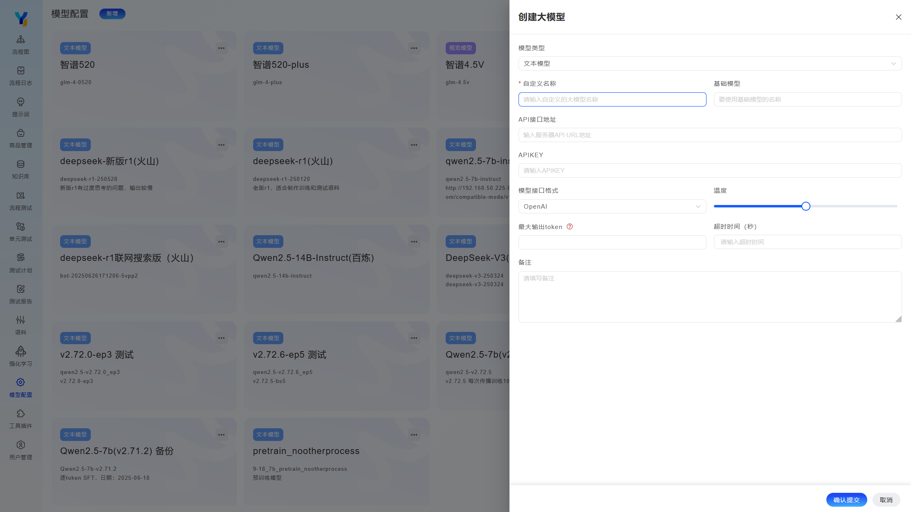
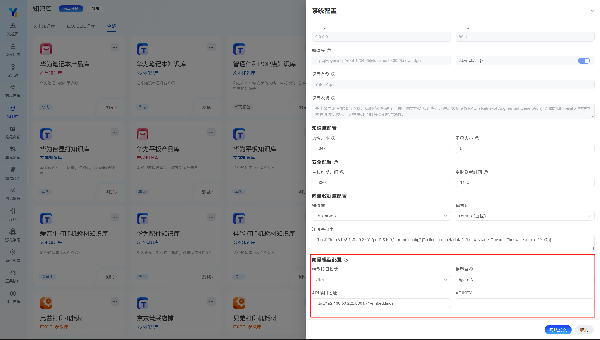
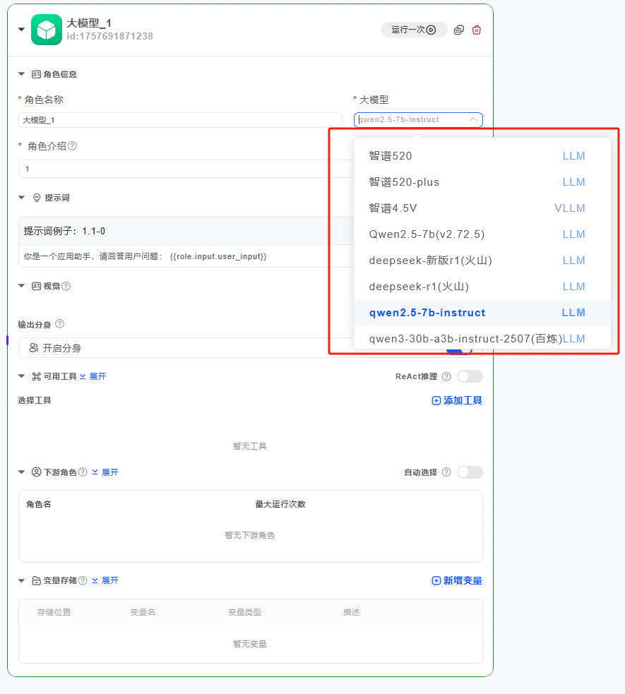

## 支持的模型

1. Y-Agent 支持与多种供应商模型的集成，支持对接当前主流的大型模型。

这包括但不限于本地Ollama、vLLM、Xinference部署的私有模型如 Llama 3 和 Qwen 2等，

国内提供的公共模型服务例如 DeepSeek、SILICONFLOW、Kimi、智谱 AI 和百度千帆、讯飞星火、通义千问，

以及国际知名的公共模型服务如 OpenAI、Azure OpenAI、Anthropic 和 Gemini 等。

2. Y-Agent 目前仅支持集成文本模型和视觉模型；

接入方式我们适配了OpenAI、Ollama、ZhipuAI等SDK，建议使用OpenAI的方式接入。

3. 关于Embedding向量模型

Y-Agent 已支持的 Embedding 模型接口规范可以在[系统配置]-[Embedding]配置项选择vllm、xinference接入方式，建议使用vllm方式。

> 对于排序算法、语音识别、语音合成、图像生成、视频生成等模型的集成，目前尚未集成。

## 接入方法
### 新增模型

导航：系统菜单中找到`模型配置`，进入后展示系统已经配置的所有模型，单击`新增`按钮，来新建一个新的模型。

添加模型时相关配置说明：

- 模型类型：文本模型，视觉模型；

文本模型：用于处理和理解文本数据的AI模型能够进行文本生成、理解、翻译、摘要等任务。

视觉模型：用于处理和理解图像/视频数据的AI模型能够进行图像识别、目标检测、图像生成等任务。

根据实际模型的类型选择配置。

- 自定义名称：用于在Y-Agent系统内部辨识区分模型。

- 基础模型名称：模型的实际名称，有模型供应商提供【或本地微调后的自定义名称】

- API接口地址：供应商开放平台提供的模型API地址，或者本地部署vllm的地址

例如：

智谱API地址：`https://open.bigmodel.cn/api/paas/v4`

千问API地址：`https://dashscope.aliyuncs.com/compatible-mode/v1`

火山API地址：`https://ark.cn-beijing.volces.com/api/v3`

本地vllm地址：`http://192.168.50.225:8000/v1/`

APIKEY：需要去对应模型开放平台申请，本地模型不需要APIKEY时可以留空。

- 模型接口格式：平台适配了OpenAI、Ollama、ZhipuAI等SDK，建议使用OpenAI的方式接入

- 温度：模型温度是生成式AI模型中的一个重要参数，用于控制模型输出文本的随机性和创造性程度，0~1之间的数字，值越大随机性越大。

- 超时时间：模型的超时时间（Timeout）是指在模型处理请求时，系统设定的最大等待时间。如果模型在规定时间内未能完成处理并返回结果，系统将中断该请求并返回超时错误。

- 最大输出token：最大输出 Token 是指在生成式 AI 模型中，单次响应所允许生成的最大 Token 数量。Token 是文本处理的基本单位，可以是一个词、一个子词或一个字符，具体取决于所使用的分词器（Tokenizer）。

### 设置Embedding 模型

导航：系统右上角->图标 系统设置->向量模型配置 

>Embedding向量模型，用于RAG文本向量嵌入，需要注意的是，更换向量模型需要对全部知识库重新向量化。

Embedding向量模型，系统只能指定一个，配置后即生效，系统自动应用，无需其他设置。

配置说明：

模型接口格式：vllm、xinference，建议使用vllm格式

模型名称：填写Embedding向量模型的名称，例如：bge-m3、embedding-3、等等

API接口地址：供应商开放平台提供的模型API地址，或者本地部署vllm的地址

例如：

智谱API地址：`https://open.bigmodel.cn/api/paas/v4/embeddings`

本地vllm地址：`http://192.168.50.225:8000/v1/embeddings`

APIKEY：需要去对应模型开放平台申请，本地模型不需要APIKEY时可以留空。

## 使用模型

在工作流中大模型节点可以选择指定当前节点使用的模型：

