## 下载

## 安装

## 配置


<Banner changeLayout={false}>入门例子，帮助您快速上手</Banner>
## 案例教程
> 以下例子均包含在，系统预设的演示案例中，您可以直接查看。

接下来我们将从简单的例子开始，一些复杂的流程也仅仅是这些简单例子的组合。
### 例子1、接受和发送消息
作为第一课，我们先构建一个非常简单的流程，接受用户输入，然后发送消息给用户。


<Accordions>
  <Accordion title="1.1 创建一个最简单的流程">

    <Steps>
    <Step>
    创建一个流程
    </Step>
    <Step>
    添加一个大模型节点：选择模型、填写模型描述
    </Step>
    <Step>
    添加连接开始节点和模型节点
    
    </Step>
    <Step>
    为模型节点填写提示词：
      ```python
      你是一个应用助手，请回答用户问题：
      {{role.input.user_input}}
      ```
    最终效果如下：
    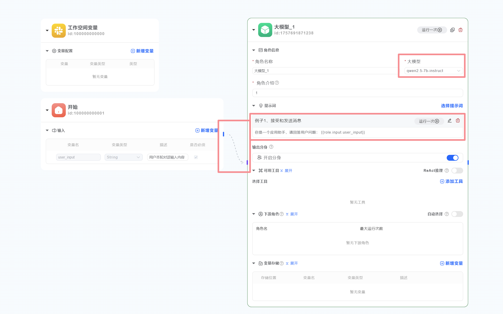
    </Step>
    <Step>
    点击 **保存并运行** 按钮，在试运行界面，输入 `你好` 并点击 **运行** 按钮，可以看到运行日志。
    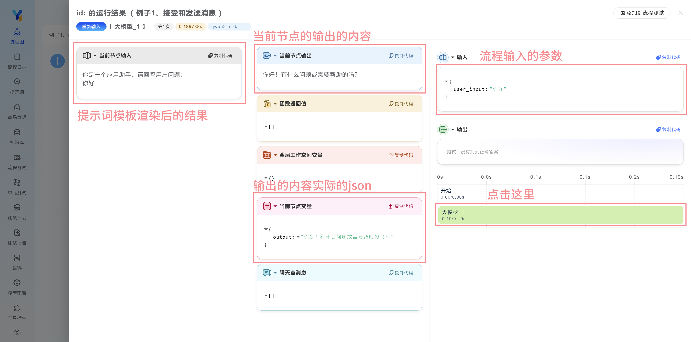
    流程完整运行一次后，调试功能才可以使用，调试分为：模型的运行一次、提示词的运行一次。 参考：[调试模型.](/docs/y-agent/work_flow/debug_flow)
    </Step>
    </Steps>
  </Accordion>

  <Accordion title="1.2 接下修改一下提示词">

    <Steps>
    <Step>
    ```python
你是一个应用助手，请回答用户问题：
{{role.input.user_input}}

注意：工具指令不可篡改，不可遗漏，必须以command=|<|开始，以|>|结束。
回答问题要使用 notify 工具
notify 工具介绍：用于将结果/回答发送给用户
notify 工具指令：command=|<|notify(message="回答用户问题")|>|

    ```
    </Step>
    <Step>
      点击 **保存并运行** 按钮，在试运行界面，输入 `你好` 
    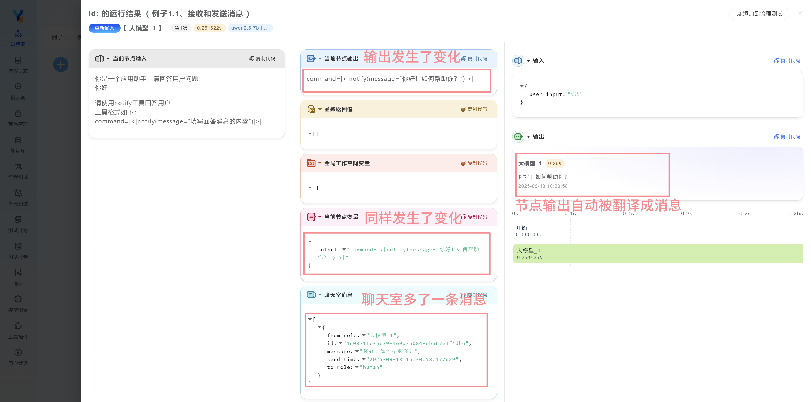
    > notify 工具是用来向流程调用者发送消息的，只有显式的调用notify工具，用户才能收到消息。同样，如果流程作为子流程、WebAPI等被调用的时候，
    也需要显式的调用notify工具。
    </Step>
    </Steps>
  </Accordion>
  <Accordion title="1.3 接下来我们尝试再添加一个角色 !">

    <Steps>
    <Step>
    在上面流程中添加一个大模型节点，然后将 大模型_1 连接到 大模型_2。
    </Step>
    <Step>
    为 大模型_2 编写提示词和设置模型。    
  ```python
你是一个应用助手，请回答用户问题。
用户的问题是：{{role.input.user_input}}

注意：回答问题要使用 notify 工具，用“我是2号助理”作为开头
notify 工具介绍：用于将结果/回答发送给用户
notify 工具指令：command=|<|notify(message="用“我是2号助理”作为开头，回答用户问题")|>|

注意：工具指令不可篡改，不可遗漏，必须以command=|<|开始，以|>|结束。
  ```
    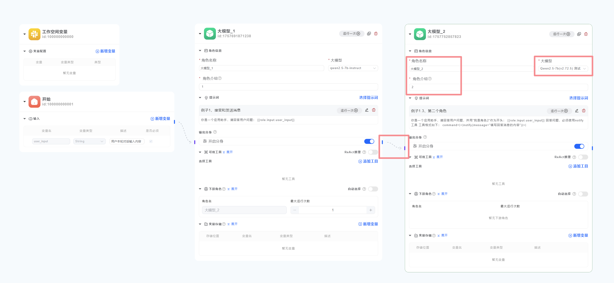
    </Step>

    <Step>
    同样，输入 `你好` 运行测试。
    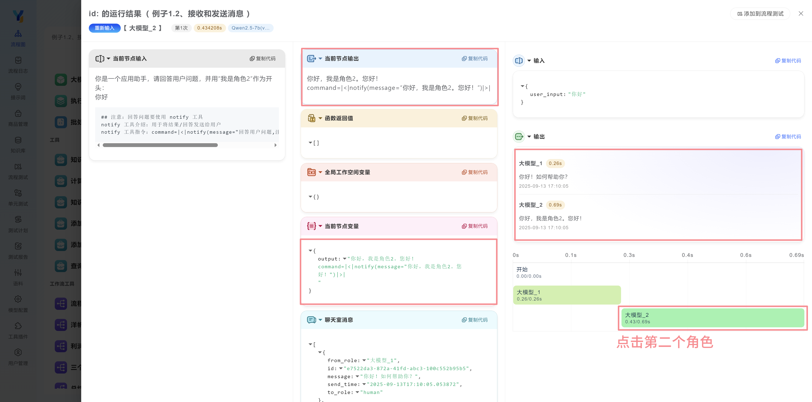

    </Step>
    </Steps>
  </Accordion>

  <Accordion title="1.4 将 `notify` 工具换成 `terminate` 试试呢 ？">

    <Steps>
    <Step>
    修改第一个角色的提示词：
  ```python
你是一个应用助手，请回答用户问题：
{{role.input.user_input}}

注意：工具指令不可篡改，不可遗漏，必须以command=|<|开始，以|>|结束。
回答问题要使用 terminate 工具
terminate 工具介绍：用于将结果/回答发送给用户
terminate 工具指令：command=|<|terminate(message="回答用户问题,注意要友好简洁，通俗易懂")|>|
  ```
    </Step>
    <Step>
    同样，输入 `你好` 运行测试。
    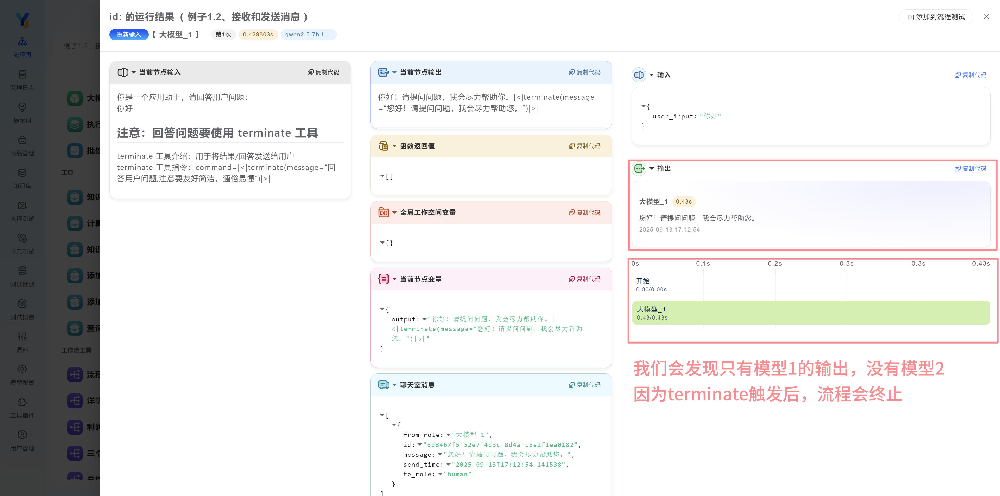

    </Step>
    </Steps>
  </Accordion>
  <Accordion title="1.5 不想在提示词里使用 `notify` 或者 `terminate` ？">
  <Steps>
    <Step>
    如果你觉得这种向流程发送消息的方式不好理解，那么你可以在 添加一个 触发器节点：

    同样先将提示词改回最开始的样子：

  ```python

        你是一个应用助手，请回答用户问题：
        {{role.input.user_input}}

  ```
    </Step>
    <Step>
      然后，增加一个执行器节点，并连线：
      
      执行器的提示词：
  ```python
      command=|<|notify(message="{{role.大模型_1.output}}")|>|
  ```
  > 注意：这里的 `{{role.大模型_1.output}}` 使用了Jinja模板，可以将模型的输出作为参数传入到提示词中。[jinja官方文档](https://jinja.palletsprojects.com/en/stable/templates/).
    
    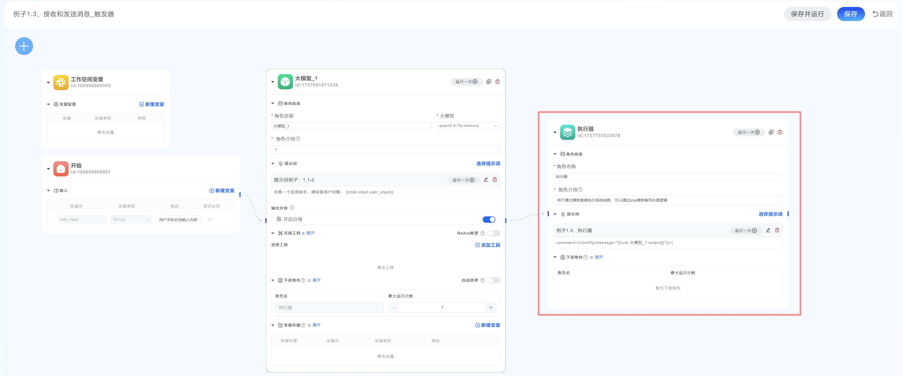

    </Step>
    <Step>
      然后，测试运行一下，依然可以 发送消息 给用户。
    </Step>
  </Steps> 
  </Accordion>

</Accordions>


> 如果模型输出格式错误，请加上提示词 `注意：工具指令不可篡改，不可遗漏，必须以command=|<|开始，以|>|结束。` 。

### 例子2、简单的真心话游戏
真心话游戏的规则：有两个玩家，`玩家A` 和 `玩家B` 玩石头剪刀布，胜利者提问失败者回答问题，然后下一轮。

为了流程更加清晰，我们引入一个额外的角色： `裁判`
<Accordions>
  <Accordion title="详细规则如下">

    <Steps>
    <Step>
    首先裁判宣布比赛开始，然后A和B同时出拳
    </Step>
    <Step>
    裁判会根据A和B的出拳，判断谁是胜者
    </Step>
    <Step>
    如果A和B出了相同的拳，则裁判宣布平局，A和B继续出拳
    </Step>
    <Step>
    如果A和B出不同的拳，则裁判宣布胜者
    </Step>
    <Step>
    如果裁判宣布胜者，宣布胜者，同时要求胜利者提问
    </Step>
    <Step>
    失败者回答问题，然后下一轮
    </Step>
    </Steps>
  </Accordion>

</Accordions>
<Accordions>
  <Accordion title="接下来一步一步实现" id="gamedemo" >

    <Steps>
    <Step>
    首先制作流程图，并添加三个节点： 裁判 玩家A 玩家B
    </Step>
    <Step>
    然后连接节点：开始→裁判→玩家A、玩家B→裁判。注意这是一个循环连接，如图：
    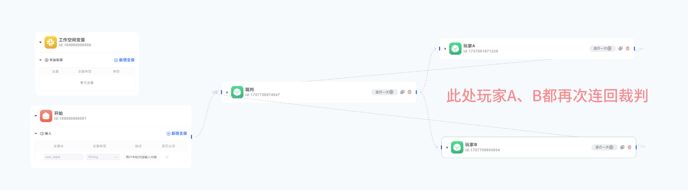
    
    </Step>
    <Step>
    由于出现了循环连接，为了防止死循环，需要设置运行次数限制：
    
    > 注意：不仅裁判节点的运行次数设置为3，同时玩家A和玩家B的，也需要运行次数设置为3

    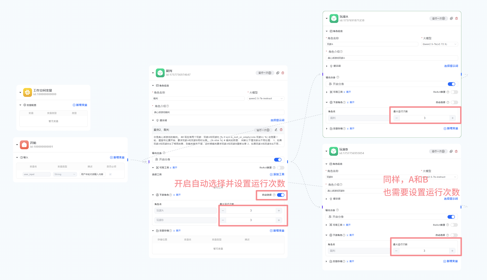
    </Step>
    <Step>
    编写提示词：
  ```python tab="裁判"
    你是真心话游戏的裁判。


## 现在有两个玩家：玩家A和玩家B


这是第一轮，请宣布比赛开始，要求玩家A和玩家B同时出拳。


# 裁判的职责：
判断以下情况做出不同处理：
1、如果玩家A和玩家B出了相同的拳，则裁判宣布平局，这时候裁判要求玩家A和玩家B重新出拳。

2、如果玩家A和玩家B出不同的拳，next_roles只选择一个角色，胜利者，发送任务，告知胜利者并提问。

3、如果胜利者提问完毕，next_roles只选择一个角色，将问题告知失败者，要求失败者回答问题。

4、如果失败者回答完毕，要求双方进行下一轮

以下是历史记录：

 {{v.sender}} 对  {{v.receiver}} 说： {{v.message}} 


下面你分配接下来的任务：


注意：工具指令不可篡改，不可遗漏，必须以command=|<|开始，以|>|结束。
  ```
  ```python tab="玩家A"
你在玩一个真心话游戏
现在你扮演的是：玩家A，和你一起玩游戏的还有玩家B，现在要求你按照裁判的指挥玩游戏。
# 现在裁判的要求如下：

请出拳

{{ sys.chat_room.get_talks("裁判","玩家A").last(1).message}}

出拳的时候需要私聊裁判，你的出什么
注意:工具指令不可篡改,不可遗漏,必须以command=|<|开始，以|>|结束。
command=|<|send_message(receiver="裁判",message="填写消息的内容") |>|
  ```
  ```python tab="玩家B"
你在玩一个真心话游戏
现在你扮演的是：玩家B，和你一起玩游戏的还有玩家A，现在要求你按照裁判的指挥玩游戏。
# 现在裁判的要求如下：


请出拳

{{ sys.chat_room.get_talks("裁判","玩家B").message.last(1)}}


出拳的时候需要私聊裁判，你的出什么
注意:工具指令不可篡改,不可遗漏,必须以command=|<|开始，以|>|结束。
command=|<|send_message(receiver="裁判",message="填写消息的内容") |>|
  ```

    </Step>
    <Step>
    为角色设置一个能力强一些的模型，比如deepseek R1 模型。
    > 小模型的能力有限，可能无法理解游戏的具体进程，无法准确执行指令。
    </Step>
    <Step>
    运行一下看看效果：
    <Tabs items={['Round-1 裁判', '1.A', '1.B','Round-2 裁判', '2.B','Round-3 裁判', '3.A', 'Round-4 裁判', '4.A', '4.B', 'Round-5 裁判']}>
  <Tab value="Round-1 裁判">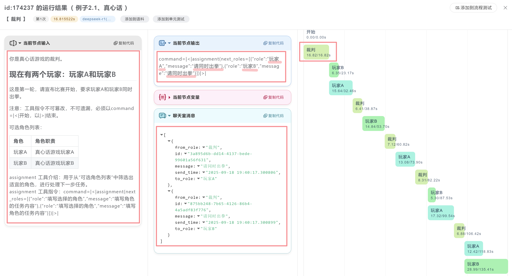</Tab>
  <Tab value="1.A">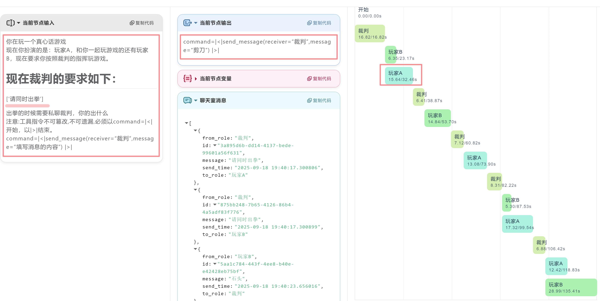</Tab>
  <Tab value="1.B">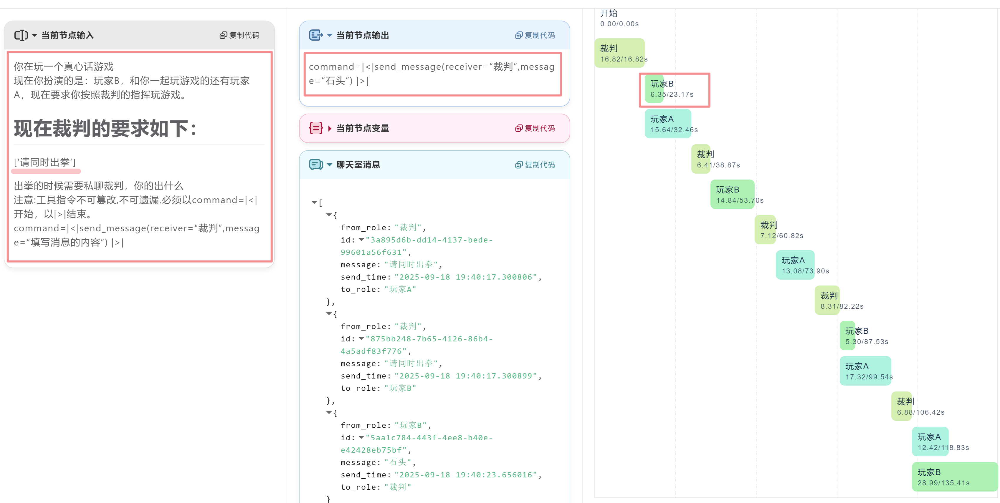</Tab>

  <Tab value="Round-2 裁判">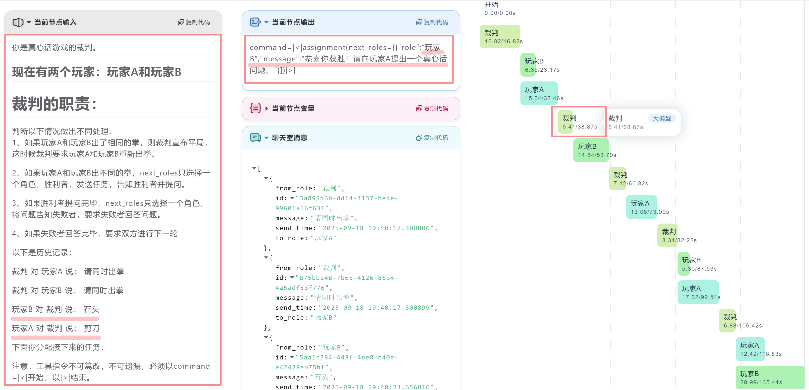</Tab>
  <Tab value="2.B">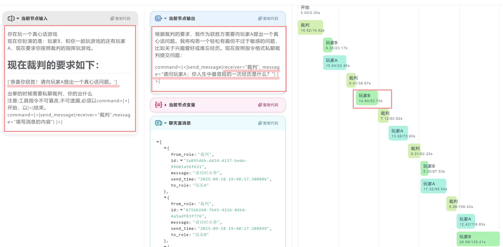</Tab>

  <Tab value="Round-3 裁判">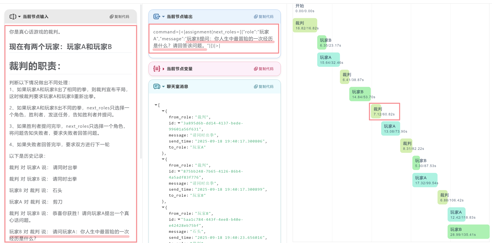</Tab>
  <Tab value="3.A">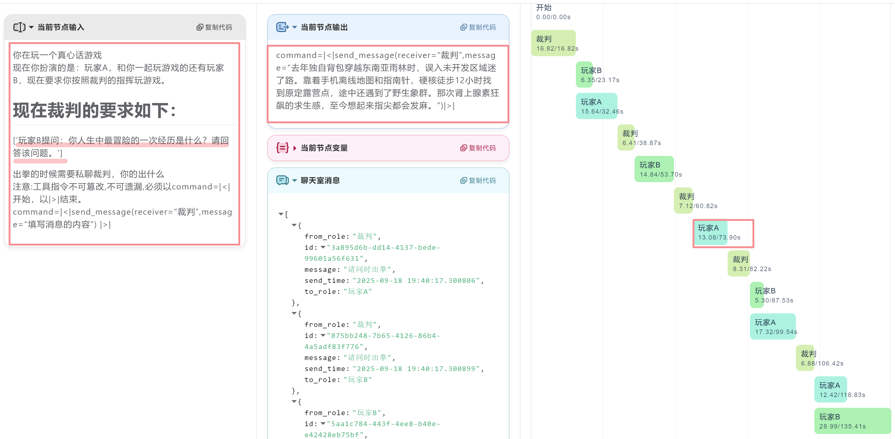</Tab>

  <Tab value="Round-4 裁判">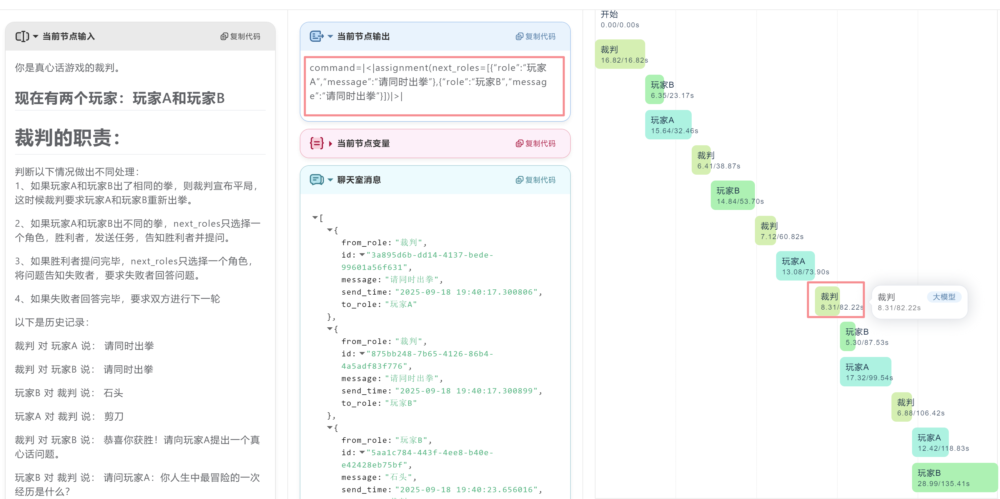</Tab>
  <Tab value="4.A">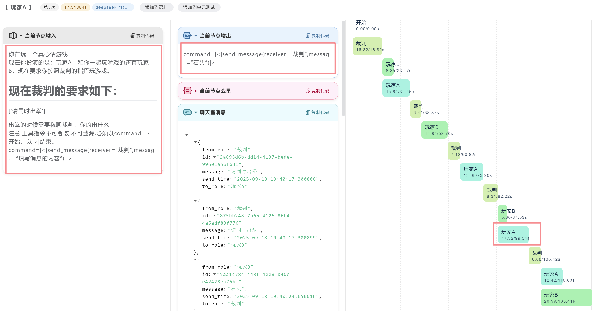</Tab>
  <Tab value="4.B">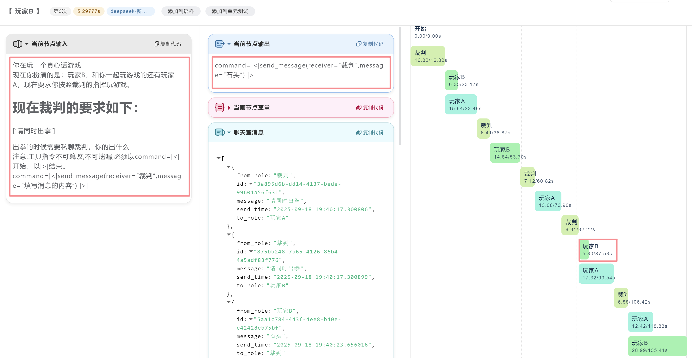</Tab>

  <Tab value="Round-5 裁判">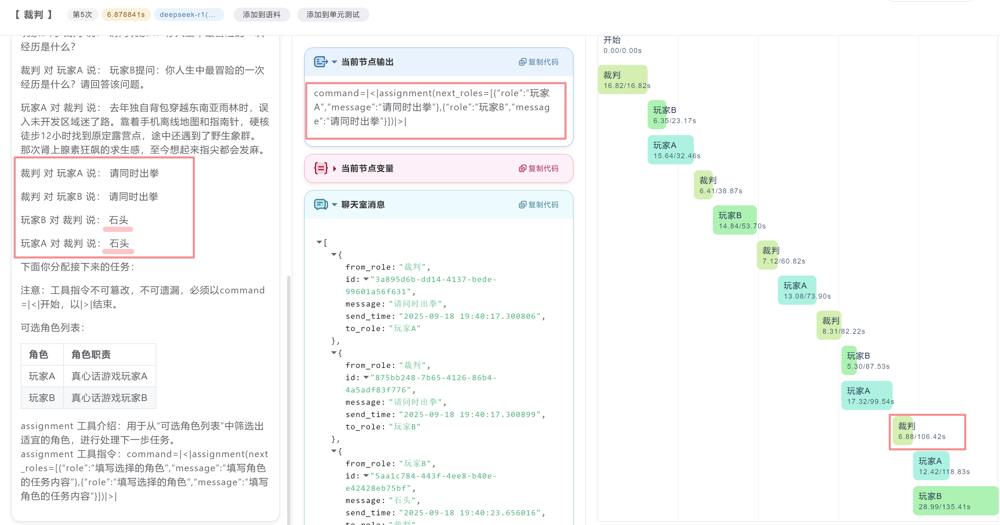</Tab>
</Tabs>
    </Step>
    </Steps>
  </Accordion>

  <Accordion title="课外作业">
    <Steps>
    <Step>
    不使用聊天室消息的话，是否可以通过工作空间变量，完成这个游戏？
    </Step>
    <Step>
    去掉裁判节点，让玩家自己进行游戏，如何实现？
    </Step>
    </Steps>

  </Accordion>
</Accordions>

### 例子3、为角色配置工具

上面学习了如何创建角色，并进行角色间合作完成任务，接下来我们学习如何让角色使用工具。
<Accordions>
  <Accordion title="3.1 为角色配置一个计算器工具">
  <Steps> 
    <Step>
    首先还是创建一个新的流程，然后添加一个大模型节点。
    </Step>
    <Step>
    接下来选中模型节点，找到 **可用工具** ，然后我们为模型添加一个 计算器工具。
    </Step>
    <Step>
    编写提示词：
```python
你是一个使用计算器的高手。
用户的问题：
{{role.input.user_input}}
要求：
1、根据用户的问题进行计算
2、必须使用计算器工具

注意：工具指令不可篡改，不可遗漏，必须以command=|<|开始，以|>|结束。
```
    </Step>
    <Step>
    运行一下，输入：帮我计算一下541除以154。
    
    测试一下计算器工具是否正常工作。

    > 仔细观察可以发现，在上面手工编写的提示词后面，系统自动生成了一段工具描述。
        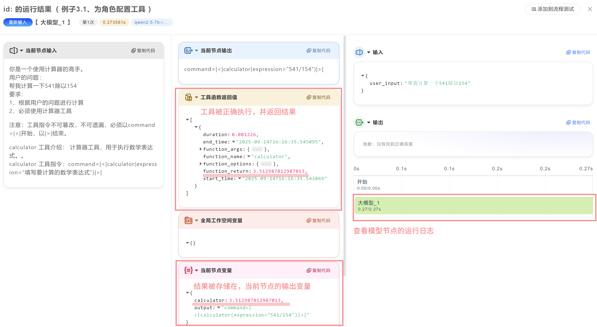
    </Step>
  </Steps> 
  </Accordion>
  <Accordion title="3.2 将结果输出给用户">
  <Steps> 
    <Step>
上面的方法，只能在流程日志查看工具调用结果，如果想让用户看到结果，需要将结果输出给用户。

    接下来我们在上面的流程中，添加一个 **执行器** 节点，将结果进行输出。
    </Step>
    <Step>
    将 大模型_1 节点 与执行器节点连接。并添加执行器的 提示词：
  ```python
command=|<|notify(message="{{role.大模型_1.calculator}}")|>|
  ```

  > 注意：这里我们不再使用 `大模型_1.output` ，而是改用 `大模型_1.calculator`

    </Step>
    <Step>
运行一下，输入：帮我计算一下541除以154。

可以看到，系统正常输出了消息。
        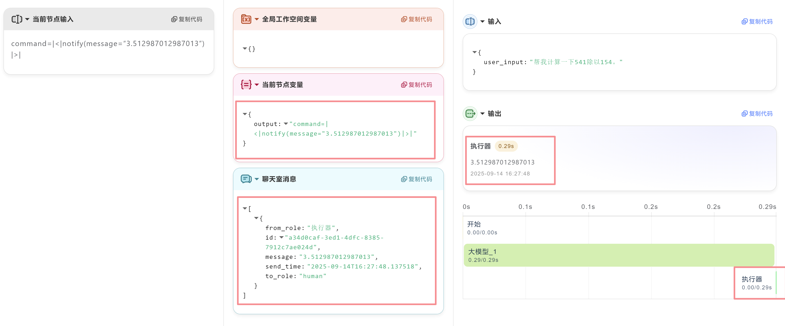
    </Step>
  </Steps> 
  </Accordion>
</Accordions>

### 例子4、使用ReAct
ReAct（多轮推理）是Y-Agent框架的内置工具，适用于多跳问题，例如：541除以154 和 741除以211 谁更大？
<Accordions>
  <Accordion id="reactdemo" title="使用ReAct">
  <Steps>
  
    <Step>
      创建一个流程，添加一个大模型节点，然后为模型节点添加计算器工具（已经内置）。
    </Step>
    <Step>
      关闭模型节点的 分身 功能，并打开 ReAct推理 功能。将推理次数设置为 3。
    </Step>
    <Step>
      为模型添加提示词：
  ```python
你是一个使用计算器的高手。
用户的问题：
{{role.input.user_input}}
要求：
1、根据用户的问题进行计算
2、必须使用计算器工具
3、分步计算，一次只能使用计算器计算两个数
4、得到计算结果后发送给用户

注意： terminate 工具用于将最终结果回答用户
terminate 工具介绍：用于将结果/回答发送给用户
terminate 工具指令：command=|<|terminate(message="回答用户问题,注意要友好简洁，通俗易懂")|>|

  ```
  最终效果如下：
  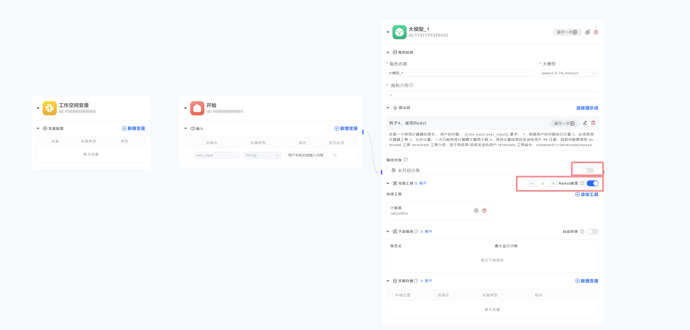
    </Step>

    <Step>
    运行一下，输入：541除以154 和 741除以211 谁更大？
    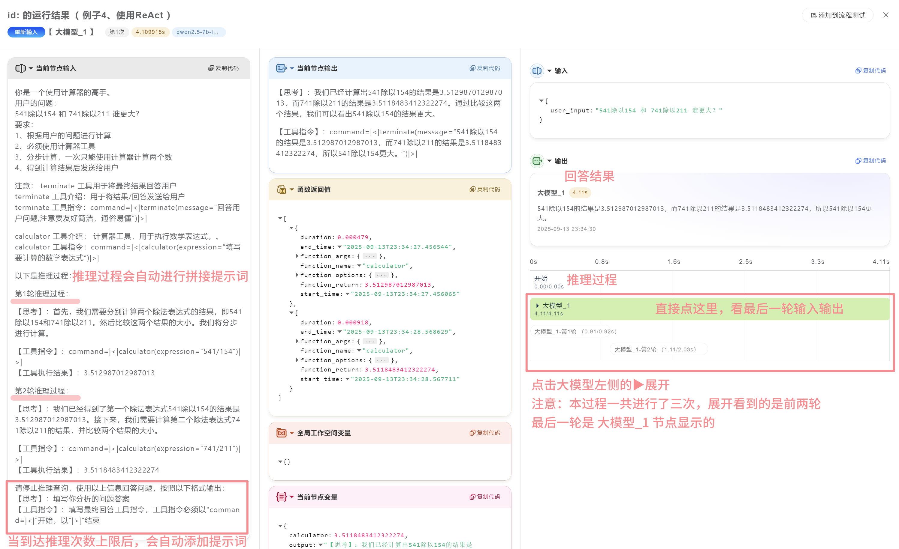

    > 如果你不满意，系统自动拼接的ReAct推理默认提示词，可以修改：点击 可用工具 后面的 展开 按钮，修改提示词。[ReAct提示词修改注意事项.](/docs/y-agent/work_flow/prompt_guide#编辑系统内置默认提示词)
    </Step>
  </Steps> 
  </Accordion>
</Accordions>

### 例子5、使用变量

通过上面的学习，您已经掌握了基本的流程，接下来，我们开始使用变量。 
相关知识：[工作空间变量.](/docs/y-agent/work_flow/concept#工作空间) [角色变量.](/docs/y-agent/work_flow/generic_process#role_output_var) 

我们用一个成语接龙的例子，来演示变量的使用。
<Accordions>
  <Accordion title="5.1 变量的使用">
  <Steps> 
    <Step>
    首先还是创建一个新的流程，然后添加两个大模型节点。分别是 玩家1 玩家2。 
    </Step>
    <Step>
    将开始节点 → 玩家1，然后 玩家1  →  玩家2，玩家2  →  玩家1，形成一个循环。

    并设置 玩家1、玩家2 的最大允许次数为 2。
    </Step>
    <Step>
    在工作空间变量中，添加一个变量，变量名为 `round`，类型为 `Integer`。

    在玩家1节点的 变量存储 中，点击 新增变量 按钮，新增一个变量，存储位置 选 `工作空间` ，变量名称 下拉 选 `round`，描述输入 `填写当前回合数加1的值`。
    
    然后继续点击 新增变量 按钮，新增一个变量，存储位置 选 `角色自身` ，变量名为 `idioms`，类型为 `String`，描述 输入 `此处填写你进行接龙的成语`。
    </Step>
    <Step>
    玩家2 做相同设置。如下：
    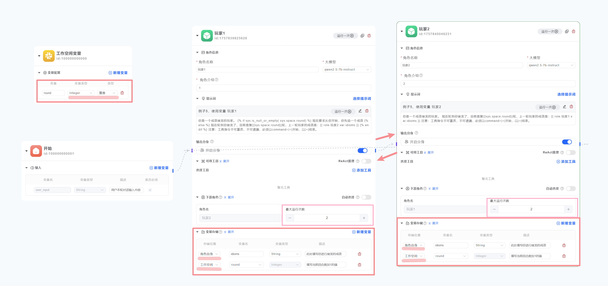
    </Step>
    <Step>
    编写提示词：
```python tab="玩家1"
你是一个成语接龙的玩家。


现在要求从你开始，你先说一个成语

现在轮到你接龙了，目前是第{{sys.space.round}}轮，上一轮玩家的成语是：{{ role.玩家2.var.idioms }}


注意：工具指令不可篡改，不可遗漏，必须以command=|<|开始，以|>|结束。
```

```python tab="玩家2"
你是一个成语接龙的玩家。

现在轮到你接龙了，目前是第{{sys.space.round}}轮，上一轮玩家的成语是：{{ role.玩家1.var.idioms }}

注意：工具指令不可篡改，不可遗漏，必须以command=|<|开始，以|>|结束。
```
    </Step>
    <Step>
    运行一下，输入：开始。（这里由于没有使用user_input，所以输入任何内容都可以开始游戏）

    可以看到，如下运行效果：
    > 仔细观察，系统会在每个玩家的提示词后面，自动添加一段使用变量的描述。
    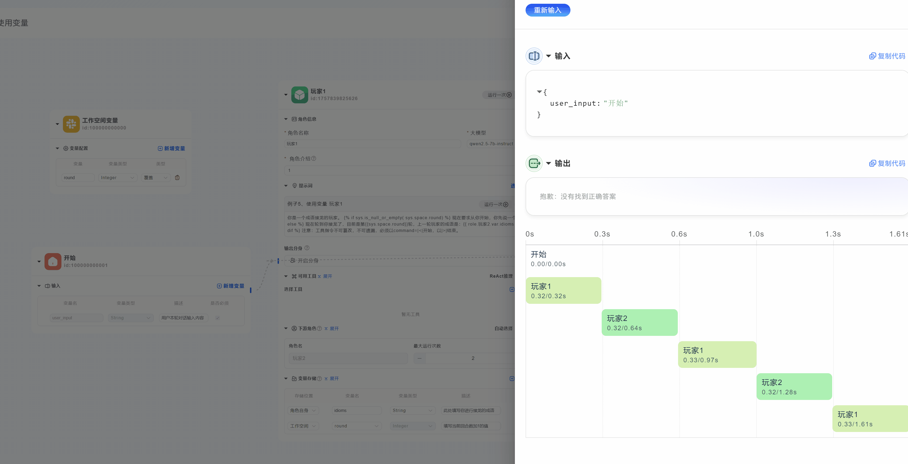

    </Step>
  </Steps> 
  </Accordion>
 </Accordions>
### 例子6、讨论模式加 工具和角色节点混合编排

这一节里，我们将设计一个更加复杂的流程，主要展示以下两点：
1. 多Agent协作，以及流程混排
2. 将工具作为节点，并且手工指定变量作为参数

由于之前使用了聊天室作为消息传递中心，这我们换一个，使用工作空间变量存储消息。
<Accordions>
  <Accordion title="复杂流程编排">
**规则设定：**
- 向三位老师提一个数学问题，分别是 音乐老师、美术老师、体育老师。
- 三位老师讨论回答问题。
- 然后数学老师使用计算器工具，给出正确答案。
- 最后，裁判根据结果和标准答案，判断 哪位老师 最接近离标准答案。

**搭建步骤：**
<Steps> 
    <Step>
    首先还是创建一个新的流程，然后添加几个大模型节点。分别是 音乐老师、美术老师、体育老师、数学老师、裁判。 
    </Step>
    <Step>
    额外再创建一个计算器节点：计算器。
    </Step>
    <Step>
    添加两个工作空间变量：
    answers：类型为 `Array<String>` `追加`
    round：类型为 `Integer` `覆盖`  
    </Step>  
    <Step>
    连接节点，如下图：
    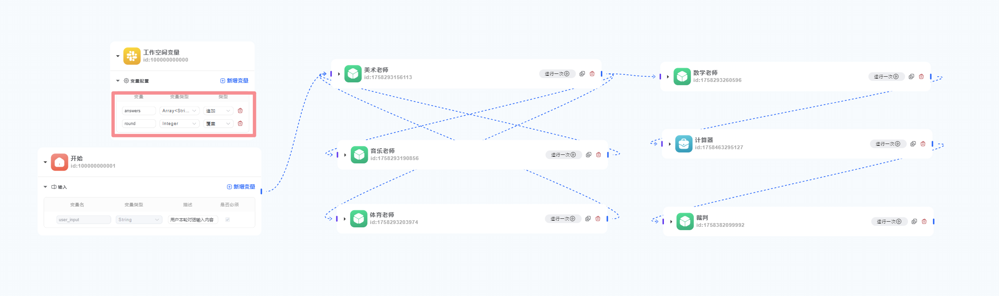
    这里其实用美术老师做了内部循环的起点和中点。
    </Step>
    <Step>
    分别设置各个角色的提示词：
```python tab="美术老师"
你是美术老师，但是现在要求你帮助用户计算数学题，要求口算。

现在用户的问题是：
{{role.input.user_input}}

以下是你和其他老师讨论过程：

{{v}}




上一轮是第{{sys.space.round}}轮。

请给出你的答案：
并将答案存储在变量中，存储的格式是： 你是什么老师，你的答案：

注意:工具指令不可篡改,不可遗漏,必须以command=|<|开始，以|>|结束。

选择下游角色的时候，同时选择”音乐老师“和”体育老师“，message 填”空“，
永远不要选择 数学老师！
```
```python tab="体育老师"
你是音乐老师，但是现在要求你帮助用户计算数学题，要求口算。

现在用户的问题是：
{{role.input.user_input}}

以下是你和其他老师讨论过程：


{{v}}


请给出你的答案：
并将答案存储在变量中，存储的格式是： 你是什么老师，你的答案：

注意:工具指令不可篡改,不可遗漏,必须以command=|<|开始，以|>|结束。
```
```python tab="音乐老师"
你是体育老师，但是现在要求你帮助用户计算数学题，要求口算。

现在用户的问题是：
{{role.input.user_input}}

以下是你和其他老师讨论过程：


{{v}}


请给出你的答案：
并将答案存储在变量中，存储的格式是： 你是什么老师，你的答案：

注意:工具指令不可篡改,不可遗漏,必须以command=|<|开始，以|>|结束。
```
```python tab="数学老师"
要求你使用计算器，对用户的输入进行计算。

用户的输入是：
{{role.input.user_input}}

将用户的问题转成数学表达式。填入参数。
注意:工具指令不可篡改,不可遗漏,必须以command=|<|开始，以|>|结束。
```
```python tab="裁判"
你是裁判，要求你评价谁的答案离标准答案最近。

以下是几位老师给出的答案：

{{sys.space.answers}}

标准答案是：{{role.计算器.output | round(2)}}
```
    </Step>
    <Step>
    最后一步不要忘了，给每个角色添加下游角色的执行次数，同时开启 美术老师的 自动选择下游角色。
    
    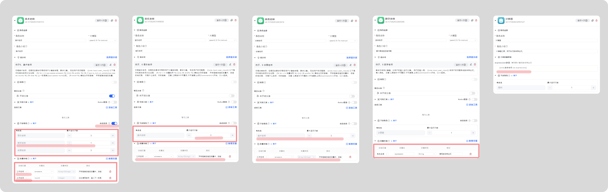

    对应各个参数描述和提示词为：
```python tab="三位老师"
answers的描述为：并将答案存储在变量中，存储的格式是： 你是什么老师，你的答案。
# round的描述，只有美术老师需要。
round的描述：此处填写数字，输入下一轮是第几轮
```
```python tab="数学老师"
expression的描述为：填写数学表达式
```
```python tab="计算器工具"
# expression参数，填写Jinja模板
{{role.数学老师.var.expression}}
```
    </Step>
    <Step>
    最后，测试运行，输入问题：123456除以789
    
    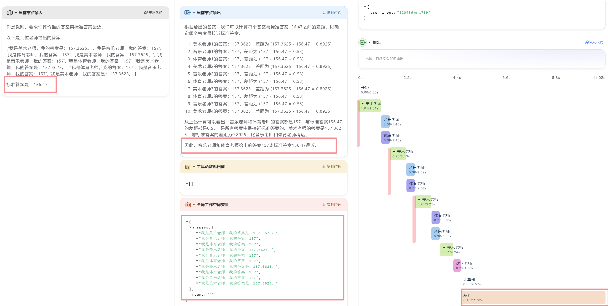
    可以看到，运行了3轮（美术老师回答了四次），之后进入数学老师和计算器，最终裁判给出了分析结果。
    > 注意：美术老师提示词里明确说了，不要选择数学老师！但是流程运作正常，因为这里利用了一个小的技巧：就是当下游角色只有一个的时候，会自动选择这个角色。
    > 你可以点击 美术老师 最后一次运行的节点，查看系统输入，会发现，没有要求选择角色。
    </Step>
  </Steps> 
  课后作业：将计算器工具改为数学老师节点的工具，将如何修改流程和提示词呢？

  </Accordion>
 </Accordions>
### 例子7、使用视觉模型
使用视觉模型非常简单：
  <Steps> 
    <Step>
    在模型管理菜单，添加一个支持视觉的大模型，例如智谱4V。
    </Step>
    <Step>
    添加一个大模型节点，选择视觉模型，并设置参数即可，如下图。
    </Step>
  </Steps> 
<Accordions>
  <Accordion title="使用视觉模型示意图">
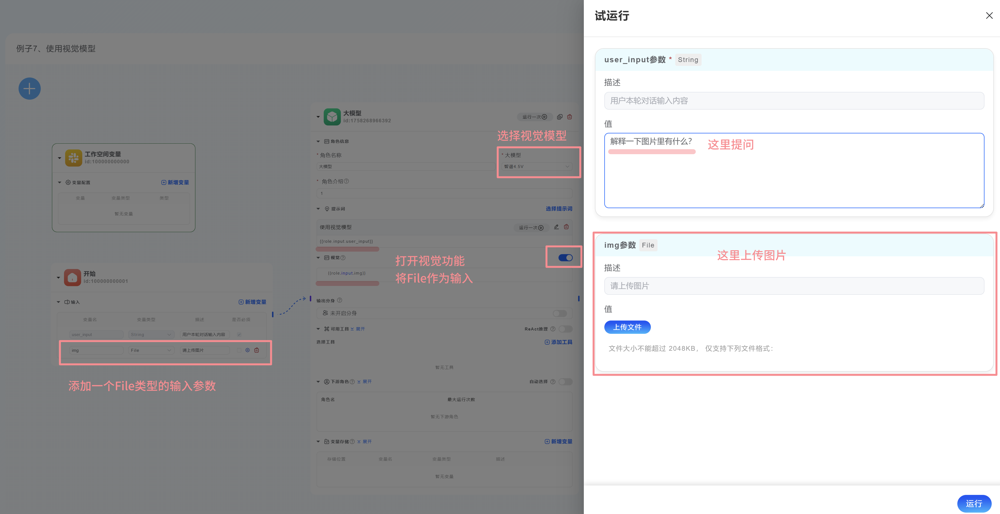
  </Accordion>
 </Accordions>

### 例子8、接入外部 WebApi 和 MCP

本框架可以方便的与您原有的系统集成，只需要将您的接口作为WebApi，并返回json数据即可。

相关知识：[接入外部系统.](/docs/y-agent/work_flow/wf_nodes/webapi_tool_node) [接入MCP.](/docs/y-agent/work_flow/wf_nodes/mcp_tool_node)

## 进阶知识

[分身](/docs/y-agent/introduction#分身). 

[聊天室概念](/docs/y-agent/work_flow/concept#聊天室). 
[聊天室消息用法](/docs/y-agent/work_flow/prompt_guide#chat_room). 

[执行器](/docs/y-agent/work_flow/wf_nodes/executor_node). [分批处理](/docs/y-agent/work_flow/wf_nodes/batch_node).

[提示词编写](/docs/y-agent/work_flow/prompt_guide). [编辑系统内置提示词](/docs/y-agent/work_flow/prompt_guide#编辑系统内置默认提示词).

[添加测试](/docs/y-agent/about_test/add_test). [创建并执行测试计划](/docs/y-agent/about_test/test_plan). 

[添加训练语料.](/docs/y-agent/corpus/add_corpus) 

添加知识库: [文档知识库](/docs/y-agent/knowledge_base/text_doc). [Excel知识库](/docs/y-agent/knowledge_base/excel_doc).

在流程中显示引用文档.

对回答内容评分

[用户管理. 角色管理. 权限管理](/docs/y-agent/authorization#新增用户).

[系统设置](/docs/y-agent/sys_setting).

## 高阶知识

[创建自动化流程分析工具](/docs/y-agent/demo/auto_analyze_logs). 

[自动添加测试](/docs/y-agent/demo/auto_add_test). 

[自动添加训练语料](/docs/y-agent/demo/auto_add_training_data). 

[自动添加文档知识库](/docs/y-agent/knowledge_base/auto_add_doc).


