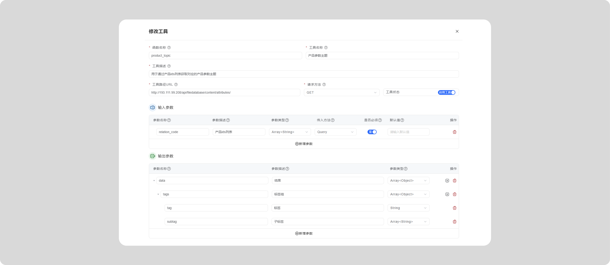

# 外部系统通过 WebAPI 调用工作流
请参考：
[通过网页或者WebAPI调用流程](/docs/y-agent/work-flow/share-flow#通过代码调用流程)
# 系统WebAPI接口

您可以通过http://ip:port/docs查询Y-Agent系统的swagger文档

<include>./work-flow/public/sys-webapi.mdx</include>

		