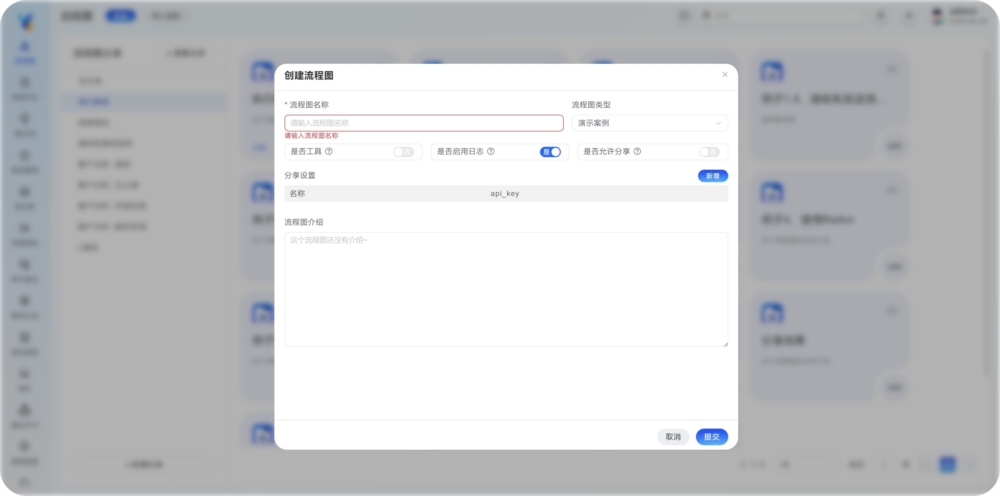
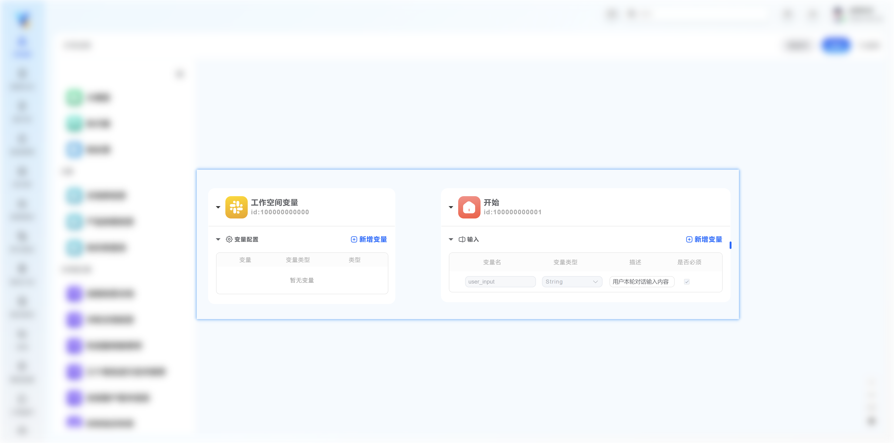
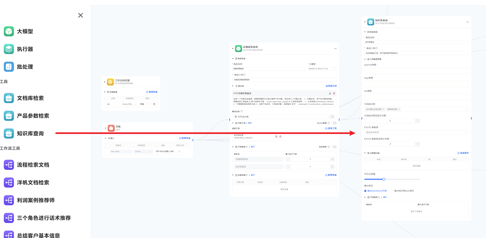

## 第一步：创建流程

点击菜单 **流程图** -- **新建**，进入创建流程环节，如图：


- #### 流程图名称

为您的流程起一个名称（必填），仅可以使用中文英文和下划线，不可以使用特殊字符和空格。
- #### 是否工具

启用后可以作为工具，供其他流程调用。 [将流程作为工具](/work-flow/wf-nodes/wf-tool-node).


- #### 是否允许分享
创建好的流程，可以通过网页分享给别人调用，也可以通过API调用。[如何分享流程](/docs/y-agent/work-flow/share-flow).

分享设置-名称：不能为空，自定义一个名称，用作识别使用者的来源。

api_key：无论是网页端使用还是WebAPI调用，都需要API_KEY作为密钥。

- #### 是否启用日志

启用后，在流程运行的时候，会自动记录流程日志，可以通过流程日志菜单查看。

> 注意：在通过API调用流程的时候，本开关仅作为 默认设置 ，如果API调用的时候，指定 日志参数 为开启，则依然会记录日志。
 [参考API调用流程](/docs/y-agent/work-flow/share-flow#通过代码调用流程).

- #### 流程图介绍

选填，可以用于简单描述你的流程，方便其他人使用，或者在流程作为工具的时候，大模型识别流程的用途。


## 第二步：编排流程

流程创建后，进入编排界面
左侧为节点区域

<Callout> 注意Y-Agent系统在流程编排的时候，不区分节点和角色，所以在后续中，角色就是指节点，节点也是角色。</Callout> 

原因参考

右侧区域为画布，默认画布上会自从创建两个基本元素，开始节点和工作空间组件


### 2.1 初始节点

#### 开始节点
作为流程的起始节点，你可以理解成入口，默认会有一个 `user_input` 参数

您可以通过 `新增变量` 按钮，自行添加需要的参数，为流程增加 入参。


#### 工作空间变量

<Accordions>
  <Accordion title="工作空间变量的详细说明">

<include>./public/work-space.mdx</include>

变量格式
<include>./public/space-var-type.mdx</include>

  </Accordion>
</Accordions>


### 2.2 添加你的节点
添加节点的操作很简单，只需要将左侧节点拖拽到画布中即可。
需要说明的是，每个节点的使用方法和输出都稍有不同，但是其中规则和逻辑类似。

以下用两个例子做说明：
#### 大模型节点


<Callout>Y-Agent框架里所有节点都等同于角色，可以自由组合，形成复杂的工作流。</Callout>

<Accordions>
  <Accordion title="大模型节点属性和填写说明">
  <include>./public/llm-node-property.mdx</include>

  </Accordion>
  
  <Accordion title="如何为大模型添加工具？">

在模型节点的 `可用工具` 点击 `添加工具` ，选中你需要的工具后，点击 右下角确定。

添加完工具后，请检查工具节点的配置是否正确。可以通过工具的设置图标进行查看和修改。

  </Accordion>
  
  <Accordion title="如何开启ReAct推理？">

开启后模型会自动进行多轮推理（本功能和分身不能同时开启）。

ReAct推理效果：

[ReAct推理的案例](/docs/y-agent/quick-start#例子4使用react).

  </Accordion>
  
  <Accordion title="如何开启自动选择下游角色？">

 
自动选择下游角色的效果：


自动选择下游角色的详细介绍](/docs/y-agent/work-flow/wf-nodes/model-node#下游角色).

  </Accordion>
  
  <Accordion title="角色自身如何输出变量？" id="role-output-var">

<include>./public/role-output-var.mdx</include>

  </Accordion>
  
  <Accordion title="如何输出变量到工作空间？">

    如果需要模型节点将变量输出到工作空间中，需要将变量输出到工作空间中，只需要将 `变量存储` 位置设置为 `工作空间`，然后选择相应的变量名称即可。

    > 需要先在工作空间中定义变量，才能在节点中使用。


  </Accordion>
</Accordions>

    其他：[执行器节点说明](./wf-nodes/executor-node).   [分批处理](/docs/y-agent/work-flow/wf-nodes/batch-node).

#### 工具节点
工具节点包含三种节点类型：`工具` `工作流工具` 和 `插件工具`

工具除了可以作为大模型节点的工具外，也可以直接作为节点使用。

以知识库工具为例：




<Accordions>
  <Accordion title="工具节点的属性说明">

| 属性 | 说明 | 必填 |
| --- | --- | --- |
| 角色名称 | 角色名称 | 是 |
| 角色介绍 | 描述这个角色的职责，如果上游角色需要自动选择下游角色，则需要在这里说明，方便大模型选择 | 是 |
| 工具参数填写 | 根据工具的不同，会有不同的参数，具体参数使用请参考工具说明。参数值可以填写变量，也可以填写常量。 |   |

  </Accordion>
  
  <Accordion title="如何为工具节点添加参数？">

```js tab="填写固定参数"
可以填写固定值：
"固定值"
或者，数组：
["固定值1", "固定值2"]
```
```js tab="填写变量参数"
例如要工具的某个参数上，填写开始节点的用户输入：
{{role.input.user_input}} # role.节点名称 可以读取指定节点名称的变量
```

> 当工具作为节点时，不显示工具参数描述（因为描述内容是给模型使用的，而节点参数需要人工指定）。

[参数填写技巧](/docs/y-agent/work-flow/wf-nodes/tool-setting#填写参数值的具体说明).

  </Accordion>
</Accordions>


其他：[内置工具](/docs/y-agent/work-flow/wf-nodes/df-tool-node). [工作流工具](/docs/y-agent/work-flow/wf-nodes/wf-tool-node). 
[MCP工具](/docs/y-agent/work-flow/wf-nodes/mcp-tool-node).和 [插件工具](/docs/y-agent/work-flow/wf-nodes/webapi-tool-node).

#### 连接各个节点

将鼠标移动到节点的右侧边缘，光标会变成十字形，按住左键拖动到另一个节点的左侧边缘即可建立连接。
节点之间可以循环连接，如下图所示：


### 2.3 编写提示词
提示词统一由提示词模块管理，这样的好处是：


1. 不同的节点可以复用同一个提示词，节省了工作量。
2. 并且提示词提供版本记录，可以方便的对比不同版本的提示词。


<Accordions>
  <Accordion title="新建 或者 编辑提示词">

大模型节点可以直接新建、编辑提示词，也可以通过提示词模块管理：

1. 新建：在大模型节点中点击“选择提示词”按钮，进入提示词管理页面，点击“新建”按钮，填写提示词内容。

也可以选择提示词模块中的提示词，进行复用。*注意:如果修改了提示词，其他使用该提示的节点也会跟着变化。*

2.  编辑：在大模型节点中选择了一个提示词，可以直接点击 {<PenLine  className="inline-flex items-center gap-1.5 text-sm text-fd-muted-foreground size-4 text-fd-muted-foreground" />} 按钮，进入提示词编辑页面，编辑提示词内容。

也可以在提示词管理页面，点击提示词名称，进入提示词编辑页面，编辑提示词内容。

  </Accordion>
</Accordions>

更多：[提示词编写指南](./prompt-guide).

## 第三步、试运行流程

在 **流程图** 编辑页面中，点击 右上角 **试运行** 按钮，填写相关参数，点击下方 **运行** 按钮 即可预览流程运行效果。

调试流程时，可以点击 **调试** 按钮，进入调试页面。  [如何调试流程和提示词？](./debug-flow).


## 第四步、分享流程

保存好流程，进入流程管理界面，点击 流程右下角 **分享** 按钮，即可分享流程。

支持 网页地址分享 和 WebAPi调用。 [将流程分享为WebAPi](/docs/y-agent/work-flow/share-flow).


<Accordions>
  <Accordion title="流程的导入导出">

除了手工创建流程，还可以，导入导出流程，方便与他人分享：


流程的导出文件为json格式。

导出流程的时候，系统会把流程所引用的 `插件工具` `流程工具` `提示词` 一起打包导出。

具体规则，请参考：[流程的导入导出](/docs/y-agent/work-flow/import-export-wf).

  </Accordion>
</Accordions>

