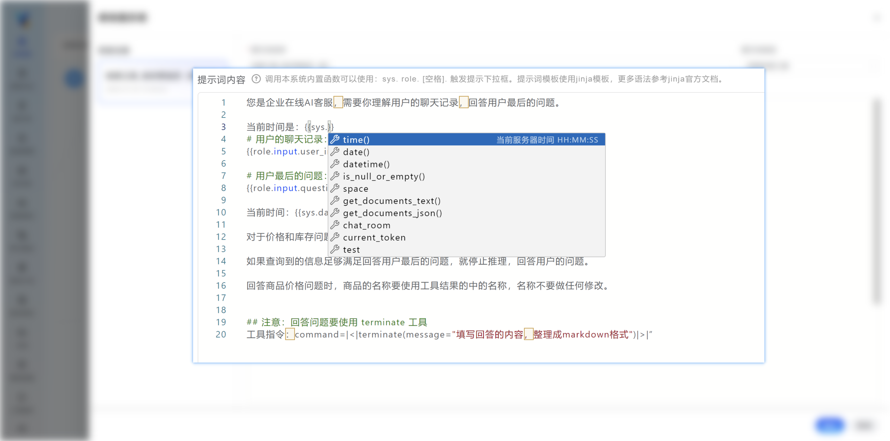

<Callout type="info"> 本系统 **不依赖** 任何模型的 `Function Calling` 能力，只需要按照提示词模板填写，即可调用工具。 </Callout>

## 提示词的构成
提示词模板与系统内置提示词。

<div className='flex justify-center items-center *:max-w-[200px] bg-gradient-to-br from-fd-primary/10 rounded-xl border'>
    
</div>

- **提示词模板**：在此区域，用户可以根据具体需求，自主编写指导大模型执行任务的指令。用户可以利用系统提供的各种模板格式进行填写，系统将自动识别并替换相应的内容，以实现个性化的任务处理。这一设计极大地提升了大模型节点的灵活性和用户操作的便捷性。
- **系统内置提示词**：这一部分涵盖了丰富的功能提示词，包括但不限于工具调用、选择下游流程、变量存储、React推理以及任务分身等操作。这些提示词是固定的，由系统程序预先设定，确保了流程的稳定性和可靠性，用户无法对其进行编辑。


### 系统模板规则

调用系统内置函数可以使用以下关键字，会自动触发提示下拉框，方便您使用：

<Cards>
  <Card title="sys." href="/docs/y-agent/work-flow/prompt-guide#系统函数-sys">触发系统函数提示</Card>
  <Card title="role." href="/docs/y-agent/work-flow/prompt-guide#角色函数-role" >触发角色函数提示，流程图的所有节点统称为 **角色**</Card>
  <Card title="[空格]"href="/docs/y-agent/work-flow/prompt-guide#代码块-空格" >触发代码块提示</Card>
</Cards>


提示词模板使用 **jinja模板**，更多语法参考 [jinja官方文档](https://docs.jinkan.org/docs/jinja2/)。

#### 效果



#### 系统函数 sys.


<Accordions>
  <Accordion title="通过 sys. 触发系统函数提示框 👇">
   
| 二级  | 三级  | 四级  | 五级  | 说明/提示 | 插入内容 |
| --- | --- | --- | --- | ------ | ------ |
| time() |     |     |     | 当前服务器时间 HH:MM:SS | time() |
| date() |     |     |     | 当前服务器日期YYYY-MM-DD | date() |
| datetime() |     |     |     | 当前服务器日期时间 | datetime() |
| is_null_or_empty() |     |     |     | 判断变量是否null或者为空（包括数组长度为0的情况） | is_null_or_empty(变量名) |
| contains(A,B) |     |     |     | 查询字符串A是否包含字符串B | contains("字符串1","字符串2") |
| space |     |     |     | 工作空间 |     |
|     | .变量名称 |     |     | 工作空间定义的变量名 |     |
| get_documents_text() |     |     |     | 根据文档id获取文档内容 | get_documents_text()(\[id1,id2...\]) |
| get_documents_json() |     |     |     | 根据文档id获取文档json格式内容 | get_documents_json(\[id1,id2...\]) |
|     | .field(\["字段1","字段2"\]) |     |     | 提取json数组的指定字段 | .field(\["字段1","字段2"\]) |
|     | .id.title.content.score |     |     | 仅返回选中字段的数据 | .id.title.content.score |
| chat_room |     |     |     | 聊天室，不可以直接使用，必须使用其中的方法或者属性 | chat_room |
|     | .get_talks() |     |     | 返回聊天详细信息 id、message、time、sender、receiver | .get_talks() |
|     |     | .first(n).last(n) |     | 最早的n条最后n条 | .first(n).last(n) |
|     |     | .message |     | 返回所有符合条件的聊天内容 | .message |
|     |     |     | .first(n).last(n) | 时间最早的n条最后n条 | .first(n).last(n) |
|     | .get_talks("发送者","接收者") |     |     | get_talks的另外写法 | .get_talks("发送者","接收者") |
|     |     | .message |     | 返回聊天详细信息 id、message、time、sender、receiver |     |
|     |     |     | .first(n).last(n) | 时间最早的n条最后n条 | .first(n).last(n) |
| current_token |     |     |     | 获取当前执行流程的用户的身份 | current_token |
| test |     |     |     | 仅用于测试节点的提示词 |     |
|      | input |     |     | 获取当前测试的输入 | input |
|      | right_answer |     |     | 获取当前测试的标准答案 | right_answer |
|      | answer |     |     | 获取当前测试的测试输出 | answer |
|      | test_standard |     |     | 获取当前测试的评分标准 | test_standard |

  </Accordion>

</Accordions>

#### 角色函数 role.

<Accordions>
  <Accordion title="通过 role. 触发角色函数提示框 👇">

| 二级  | 三级  | 四级  | 说明/提示 | 插入内容 |
| --- | --- | --- | --- | --- |
| input/开始 |     |     |     | input |
|     | .user_input |     | 固定输入 | .user_input |
|     | .变量名称 |     | 自定义输入 | .变量名称 |
|     |     | .变量名称 |     | .变量名称 |
| 角色名称 |     |     | 不可以直接使用，必须使用其中的方法或者属性 | .角色名称 |
|     | .var |     | 角色自身变量输出 | .var |
|     |     | .变量名称 |     | .变量名称 |
|     | .output |    | 角色输出内容 | .output |
|     | .工具名称 |     | 工具返回值 | .工具名称 |
| get_roles_outputs() |     |     | 同时取多个角色的输出，并合并到一个数组中，field_key为要提取的字段名称，可以留空 | .get_roles_outputs(\[role1,role2...\],field_key) |
| exist() |     |     | 验证角色是否存在 | .exist('role') |

  </Accordion>

</Accordions>

#### 代码块 [空格]

<Accordions>
  <Accordion title="通过 [空格] 触发代码块提示框 👇">
  
| 以下属于代码块提示 |     | 提示 | 插入内容 |
| --- | --- | --- | --- |
| 强调输出格式的指令 |  | 当大模型输出指令经常错的时候，添加此提示词 | 注意：工具指令不可篡改，不可遗漏，必须以command=\|\<\|开始，以\|\>\|结束。 |
| send_message |     | 向聊天室发送消息 | command=\|\<\|send_message(receiver="填写角色名称",message="填写消息的内容") \|\>\| |
| notify |     | 向用户发送消息（发送完流程继续运行） | command=\|\<\|notify(message="填写消息的内容")\|\>\| |
| terminate |     | 向用户发送消息（发送完流程终止） | command=\|\<\|terminate(message="向用户发消息此处可以填写固定值或者变量")\|>\| |
| write_var |     | 写入space工作空间环境变量 | command=\|\<\|write_var(参数名=值,参数名=值)\|\>\| |
| assignment |     | 指定选择某个下游节点角色执行后续流程 | command=\|\<\|assignment(next_roles=[\{"role":"角色1","message":"消息1"\},\{"role":"角色2","message":"消息2"\}])\|\>\| |
| if  |     | if代码块 | \\\ |
| for |     | for代码块 | \\{\{v}}\ |
| batch |     | batch代码块，分批处理使用的内部临时变量，batch存储的是，当前批次的数据集 | \{\{batch}} |
|     | .index | 当前批次的序号 | index |
|     | .item | 当前批次存储的数据集，可以用for循环遍历 | item |
|     | .item\[n\] | 指定取本批次的第n条数据，n为从0开始的整数 | item\[n\] |
| for_batch例子 |     | 案例::for循环遍历，当前批次存储的数据集 | \doc.id\ |

  </Accordion>

</Accordions>

## 常用提示词案例：
### sys：
系统保留字段，集合里包含了系统默认的静态函数

**获取系统时间：**
```python
  当前时间是：{{sys.time()}}
```

**判断变量是否null或者为空**

is_null_or_empty() （包括数组长度为0的情况）
```python

    变量名是null或者为空

    变量名不为null或者不为空


```

#### space：
**工作空间变量提取**

```python tab="sapce变量提取"
  变量的值是:{{sys.space.变量名称}}
```
```python tab="~~space字典变量提取~~"

  变量的值是:{{sys.space.变量名称.字典的key}}
  # 注意：为了简化操作，此方法停用
```


**知识库文档内容获取**
get_document()，根据文档多个id提取对应内容

```python
{{sys.get_document(sys.space.ids)}}
```
返回的是文档的标题和内容：文本形式

#### chat_room：
**聊天室消息提取函数**

**提取聊天室对话文本内容：（常用）**
```python
  {{sys.chat_room.get_talks("发送者","接收者").message}}
```
返回的是聊天室对话内容
["你好","今日阳光明媚"]
提取发送者为张三的全部消息：
```python
  {{sys.chat_room.get_talks("张三","").message}}
```
提取接收者为张三的第一条消息：
```python
  {{sys.chat_room.get_talks("","张三").message.first[1]}}
```
提取接收者为张三的最后一条消息：
```python
  {{sys.chat_room.get_talks("","张三").message.last[1]}}
```


**提取聊天室对话json格式内容：（不常用）**

返回聊天室中所有消息，包括发送者、接收者、消息内容、发送时间、消息id。
聊天室中消息字段：sender，receiver，message ,send_time,id

```python tab="发送者为张三"
  {{sys.chat_room.get_talks("张三","").message}}
```

```python tab="接收者为李四"
  {{sys.chat_room.get_talks("","李四").message}}
```

```python tab="张三发给李四的消息"
{{sys.chat_room.get_talks("张三","李四").message}}
```

返回的聊天室消息的json格式数据：
```json
  [{"id":"id","from_role":"发送者","to_role":"接收者","message":"消息内容","send_time"："时间"}]
```

高级案例：
```python  tab="获取聊天室所有消息"
{{sys.chat_room.get_talks()}}
```
```python  tab="对消息格式化输出"

 {{v.sender}} 对  {{v.receiver}} 说： {{v.message}} 


```


循环以上数据
```python
 
{{item.from_role}} 对 {{item.to_role}} : {{item.message}}

```

【其他客服的回答】：
```python

# 另一种写法 if sys.is_null_or_empty(sys.chat_room.get_talks("参数客服","human"))
{{chat_room.get_talks("参数客服","human").message}}

```

### role：

**获取 开始/input 节点 用户输入：**
```python tab="默认"
  {{role.input.user_input}} 
```
```python tab="写法2"
  {{role.开始.user_input}}  
  #input=开始
```

**获取 开始/input 节点 自定义输入变量值：**
```python
  {{role.input.自定义输入变量名称.二级变量名称.三级变量名称}}
```

#### exist()
用于判断角色有没有输出内容，防止直接调用出错的情况

判断角色是否有输出内容，有输出内容返回true，没有输出内容返回false
```python


```


提取角色内【工具】返回值的内容，格式：
```python
{{role.角色名称.工具名称}}
```


注意工具返回值的类型：
知识库返回可循环的json列表，可以使用以下模板内容：
```python

{"id":"{{doc.id}}","title":"{{doc.title}}"}


```
知识库返回单个json对象格式：
```python
  {"id":"xxxxxx","score":0.50,"title":"这个是知识标题","content":"知识内容markdown格式"}
```

如果知识库返回的文本：
```python
  {{role.文档查询.product_retrieve}} #文档查询为角色名
```

**提取角色特殊的输出，如果角色没有执行任何工具，仅仅输出了一段文本，可以使用以下方式提取输出的内容**
```python
  {{role.角色名称.output}}
```

**提取角色特殊的输出，如果变量存储到了角色自身，可以使用以下格式提取**
```python
  {{role.角色名称.output.变量名称}}
```


其他案例
```python
# 判断变量是否null或者为空（包括数组长度为0的情况）




```


### 执行器
直接执行内部函数：
```python
command=|<|notify(message="你好，这是自动回复，但是流程还在运行")|>|
command=|<|terminate(message="你好，这是自动回复，收到回复后流程终止运行")|>|
command=|<|write_var(ids=[{{}}])|>|
command=|<|assignment(next_roles=[{"role":"角色1","message":"消息1"},{"role":"角色2","message":"消息2"}]) |>|
command=|<|send_message(receiver="填写角色名称",message="填写消息的内容")|>|  

```
向用户发送消息

- notify:给用户发送消息的函数，发送后流程继续执行： 

- terminate:给用户发送结束消息的函数，发送后流程不在继续执行未开始的节点：

```python
notify 工具介绍：这个工具可以把答案发送给用户
notify 工具指令：command=|<|notify(message="填写回答的内容") |>|    

terminate 工具介绍：和notify工具类似，除此之外，此工具触发后，流程不再执行任何节点，等同于流程结束（已经在运行的节点，会运行到完毕）。
terminate 工具指令：command=|<|terminate(message="填写回答的内容") |>|    
```
- 手动触发下游角色执行的函数，指定某个下游角色执行后续流程：
```python
assignment 工具介绍：用于指定某个下游角色执行后续流程。
assignment 工具指令：command=|<|assignment(next_roles=[{"role":"角色1","message":"消息1"},{"role":"角色2","message":"消息2"}]) |>|  
```

- 给其他角色发送消息的函数，仅向聊天室给指定用户发送了一条消息：** 
```python
send_message 工具介绍：用于向指定角色发送消息。
send_message 工具指令：command=|<| send_message(receiver="填写角色名称",message="填写消息的内容") |>|  
```

### 测试相关提示词
为了方便测试，可以使用大模型为测试结果打分，此时需要编写提示词模板，需要用到以下变量：

```python
## 本次测试的输入内容

{{input}}

## 参考答案

{{right_answer}}

## 测试结果

{{answer}}

## 评分准则

{{test_standard}}
```

## 编辑系统内置默认提示词

> 修改的时候需要严格遵循默认提示词的格式，否则会导致系统报错。

ReAct推理提示词：在ReAct推理开启后可编辑

```python
{
"prompt_step_part":"以下是推理过程：\n\n{step}\n\n",
"prompt_think_part":"第{react_times}轮推理过程：\n\n{think}\n【工具执行结果】：{return_value}\n\n",
"prompt_guide_part":"分析以上信息并进行思考，按照以下格式输出：\n【思考】：填写你的分析过程\n【工具指令】：填写你使用的工具指令，工具指令必须以\"command=|<|\"开始，以\"|>|\"结束\n",
"prompt_end_guide_part":"请停止推理查询，使用以上信息回答问题，按照以下格式输出：\n【思考】：填写你分析的问题答案\n【工具指令】：填写最终回答工具指令，工具指令必须以\"command=|<|\"开始，以\"|>|\"结束\n"
}
```
> 注意：里面的关键字，例如，`prompt_step_part` `{step}` 还有JSON格式，不要改动，否则会导致系统报错。

自动选择下游角色提示词：在 下游角色 自动选择 开启后可编辑

```python
assignment 工具介绍：用于从“可选角色列表”中筛选出适宜的角色，进行处理下一步任务。
assignment 工具指令：command=|<|assignment(next_roles=[{"role":"填写选择的角色","message":"填写角色的任务内容"},{"role":"填写选择的角色","message":"填写角色的任务内容"}])|>|
```

存储变量提示词

```python
write_var 工具介绍：用于将答案/结果/输出内容存储到特殊的位置。
write_var 工具指令：command=|<|write_var({variables_json})|>|
```
variables_json 是系统保留关键字，会自动渲染成需要存储的变量的json格式数据，请不要修改。


#### 如何恢复默认提示词？
重置按钮可以恢复默认。
> 注意修改后的提示词，不会自动记录版本，恢复默认后只能在流程日志里找找看了。