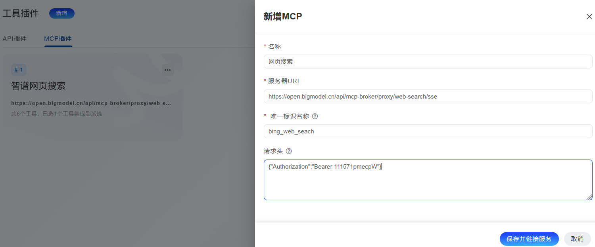
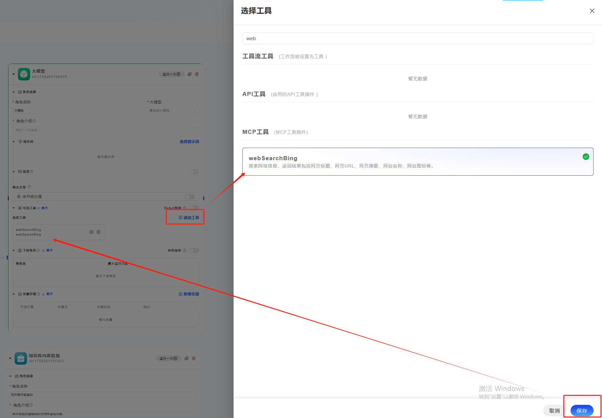

> 本文着重介绍如何在Y-Agent系统中使用MCP工具，目前只能使用支持HTTP传输的MCP服务器。

## 访问MCP插件

菜单导航：`工具插件 -> MCP插件`

### 添加一个MCP插件

单击“新增”按钮，来新建一个新的MCP外部工具提供程序:

名称：需要自定义一个名称，用于分区多个MCP服务。

服务器URL：需要填写MCP服务器的HTTP端点，例如`（https://mcp.api-inference.modelscope.net/********/mcp"）`

唯一标识名: 不可重复、保留字段(小写、数字、下划线、连字符,最多24个字符)，用于区分MCP。

请求头：可以填写请求Header中的授权令牌信息，例如：`{"Authorization":"Bearer 111571pmecpW"}`  要根据服务端的要求填写，不需要请求头验证时不要填写任何内容。

保存时，系统会自动与MCP服务端建立链接，并发现服务器端提供的工具。
添加成功后会出现一个MCP卡片，点击这个卡片进入配置MCP的第二步【选择工具】
>  注意：如与服务链接失败，需要检查修改服务地址或者修改授权信息后重新保存。

### 选择MCP服务器中的工具

每个MCP服务一般会提供N个工具，您需要选中对您有用的工具保存对接到系统，当然也可以全部勾选。

保存选择后，被选中的工具会出现在工作流的工具菜单中。

### 在工作流中使用MCP工具

成功配置MCP插件工具后，可以在工作流中直接使用工具。

＞有两种使用工具的方式：

1、作为工具节点使用。

2、作为大模型工具使用。

### MCP服务端工具更新

如发现MCP服务端工具升级，导致在工作流中报错，可以进入

`MCP插件->找到对应卡片->进入工具选择页面->点击’刷新工具’按钮`

### MCP工具删除或MCP服务端停用

当MCP工具被删除，或者MCP服务器中断服务，会导致工作流中配置的关联工具不可用，工作流不会自动卸载此工具，需要人工修改工作流。

