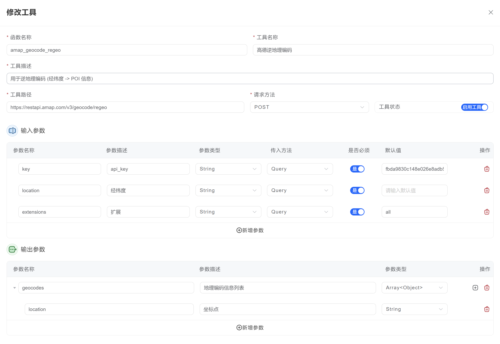
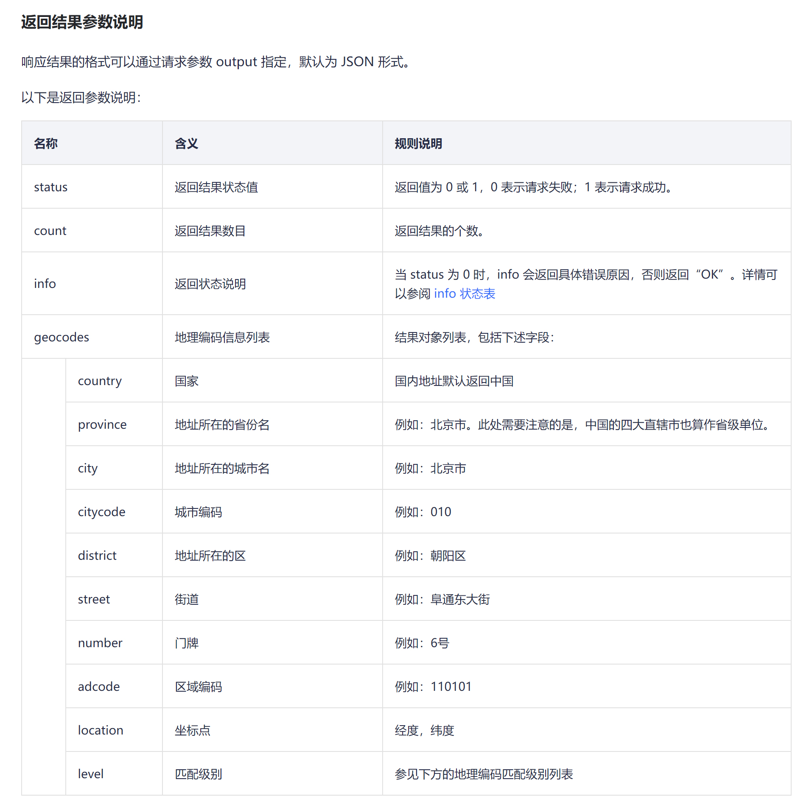

## 插件工具

插件工具允许系统将外部的 Web API 作为插件方式集成进来，扩展系统的功能能力。本文档将详细介绍插件的集成方式、参数配置以及安全设置等内容。

### 插件集成方式

集成外部 API 作为插件的操作步骤如下：

1. 进入工具插件管理界面
2. 点击「添加新插件」按钮
3. 填写插件的基本信息，包括名称和描述
4. 配置 Web API 的连接信息（如请求 URL、请求方法等）
5. 在输入参数中，添加 Web API 需要的参数，并添加描述信息，方便大模型在使用时理解和填写

        参数名称、参数类型、传入方法、是否必须，要根据远程 API 的要求进行配置。
6. 保存插件配置并启用

### 插件参数配置

| 配置项 | 说明 |
|-------|------|
| 函数名称 | 为该插件起一个名称，方便大模型调用时使用，请使用小写字母 |
| 工具名称 | 给您自己看的名称，可以自行描述 |
| 工具描述 | 给大模型看的描述信息，需要认真填写，方便大模型准确使用 |
| 工具路径URL | 工具路径就是你需要调用的外部 API 的 URL |
| 请求方法 | 按照实际情况根据远程api的要求设置 |

### 输入参数

| 属性 | 说明 |
|---------|------|
| 参数名称 | 根据远程api设置 |
| 参数描述 | 参数描述性信息，方便大模型使用 |
| 参数类型 | 根据远程api设置 |
| 传入方法 | 根据远程api设置 |
| 是否必须 | 根据远程api设置 |
| 默认值 | 在此处可填写API要求输入的参数，这些参数将作为默认值，例如API密钥、API Token等信息。 |
|  | 若填写此项，模型将不会看到和填写该参数。 |
### 输出参数
<Callout title="输出参数的作用">

此处可以不进行配置，如果留空的话，默认将输出外部 API 返回的所有参数。

调用外部API后，API会返回结果，但并非返回数据中的所有内容和参数都是必需的。

在此处可进行一次过滤，即填写的输出参数内容将被解析并作为工具的输出。

</Callout>

| 属性 | 说明 |
|---------|------|
| 参数名称 | 根据远程api的要求设置 |
| 参数描述 | 参数描述性信息，方便大模型使用 |
| 参数类型 | 根据远程api的要求设置 |

## 工具插件添加的案例：
<Accordions>
  <Accordion id="api-plugin-example" title="下面用高德的webAPI的例子展示说明：">
        
    以高德的webAPI为例：https://lbs.amap.com/api/webservice/guide/api/georegeo

    这个是一个将具体地址转换为经纬度坐标的接口。

    假设我们只需要解析返回值里边的经纬坐标 (当然你也可以解析全部内容，不设置返回值，默认将获取api返回的全部内容)。

    按照下图配置：
    

    高德接口的调用说明如下：
    
    返回值参数如下：
    

    

  </Accordion>
</Accordions>

### 参数与安全

添加插件时需要注意以下几点：

- **固定值设置**：插件添加参数的时候，可以为参数设置默认值，若填写此项，模型将不会看到和填写该参数。
- **敏感信息保护**：设置默认值后，在导出插件的时候，将不会导出该值的内容，有效防止 API Key 等敏感信息泄露，
所以强烈建议将您的敏感信息放在插件配置页面填写，而不是放在流程配置页面填写。

### 插件描述的重要性

除了参数描述外，还需要对插件的整体作用进行清晰描述。描述的作用包括：

- 输入参数描述：必须为每个参数添加详细的描述信息，这些描述将帮助大模型准确理解参数用途并正确填写。
- 帮助大模型理解插件的功能和用途。
- 使大模型能够在处理不同任务时，准确选择最合适的插件。
- 提高插件的使用效率和准确性。

编写高质量的插件描述和参数说明，是确保插件能够被大模型有效利用的关键因素。

