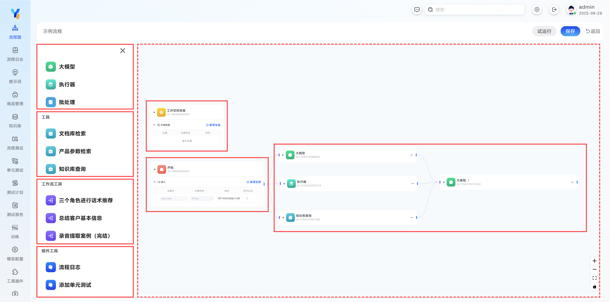
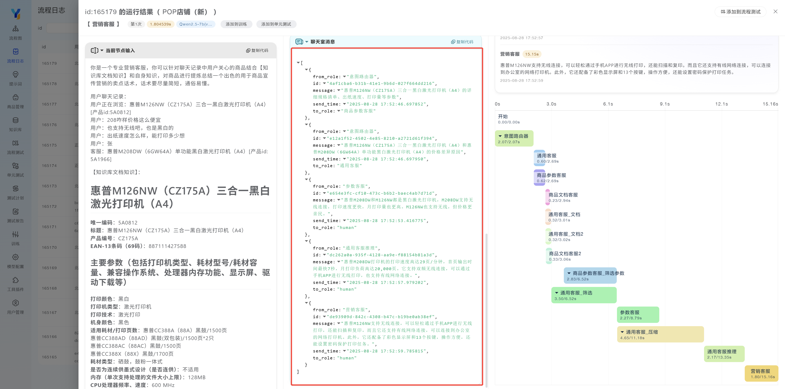

## 界面布局



---
## 屏幕左侧
节点区域，有以下节点类型

<Callout> 注意Y-Agent系统在流程编排的时候，不区分节点和角色，所以在后续中，角色就是指节点，节点也是角色。</Callout> 

### 1. 大模型：
作为AI工作的核心功能模块，依托大模型的推理能力，可以实现以下功能：
1. **灵活运用各类工具:**   [为模型节点配置工具](./wf_nodes/model_node#可用工具).
2. **智能选择下游节点:**   [自动选择下游](./wf_nodes/model_node#下游角色).
3. **实现变量存储与管理:**   [存储自身变量](./wf_nodes/model_node#变量存储).  [存储工作空间变量](./wf_nodes/model_node#变量存储).
4. **利用分身机制提升AI工作流的性能与效率:**   [分身介绍](./wf_nodes/model_node#输出分身).

### 2. 执行器

执行器类似于代码编辑器，可以编写jinja模板，实现一些固有的代码逻辑。 [jinja官方文档](https://jinja.palletsprojects.com/en/stable/templates/).

可以通过执行器，人工手动触发内部函数：
    - **notify**（向用户发送消息）
    - **terminate**（向用户发送消息，并终止流程）
    - **send_message**（向其他角色发消息）
    - **write_var**（写变量）
    - **assignment**（选择下游角色）

[执行器函数介绍](./wf_nodes/executor_node).

### 3. 工具

工具可以作为模型的可用工具，也可以作为节点使用。 

作为节点使用的时候，需要手工指定工具的参数，可以是固定值也可以通过jinja模板写变量。

[如何配置工具参数](./wf_nodes/tool_setting).
### **工作流工具**

在Y-Agent中，流程可以做工具，提供给其他流程使用。 [将流程设置为工具](./wf_nodes/df_tool_node).
### **插件工具**
为了便于和外部系统交换数据，提供了外部WebAPI转成插件的接口。 [将WebAPI作为工具](./wf_nodes/plugin_tool_node).

---
## 屏幕右侧
画布区域，用于流程编排。

### 1. 工作空间：
<include>./public/work_space.mdx</include>

[变量可以存储的数据类型](./wf_nodes/model_node#变量存储).

### 2. 开始节点
开始节点，作为AI-Agent工作流的起点，负责加载用户输入数据，需要自定义输入变量（*防止没有变量的情况，user_input 作为默认变量*）。


### 3. 结束节点
> 本系统无需单独设置结束节点。，框架可以自动确定结束时机。

**自动结束机制**：

- 所有根据内置算法，判定节点均已执行完毕
- 某个节点输出了 command=|\<|terminate(message="")|>| 指令。系统会停止所有后续节点的执行。

[关于结束指示符](/docs/y-agent/work_flow/prompt_guide#执行器).


### 4. 聊天室
- 聊天室是用于流程内多个角色沟通消息的地方。
- 比如上游角色向下游角色分配任务目标，可以写入聊天室。
例子：

`command=|<|assignment(next_roles=[{"role":"角色1","message":"消息1"},{"role":"角色2","message":"消息2"}])|>|`

也可以通过 触发函数:  `command=|<|send_message(receiver="填写角色名称",message="填写消息的内容") |>|`  向指定角色发送消息。

- 聊天室内的消息不设置权限，任何节点都可以查询使用，类似于人类在聊天软件里群聊。
- 节点向用户发送的消息也会存入聊天室。

- 在画布中不体现聊天室内容，聊天的内容需要在流程运行日志或者测试流程日志界面查看：



其中 `from_role` 代表消息发送者， `to_role` 是消息接收者（可以为空）。

<Callout>接收者为 `human` 代表用户，此时用户会收到消息，
如果整个流程没有任何接收者为 `human` 的消息，那么用户将不会收到任何消息（也就是说流程没有输出信息）。</Callout>

更多聊天室消息请查看：[聊天室消息](/docs/y-agent/work_flow/prompt_guide#chat_room).

## 提示词相关

在Y-Agent中，有一套自己的提示词规范，可以帮助用户方便稳定的搭建流程。

### 主要概念：

提示词模板使用jinja语法，
模型的提示词分成以下几部分，可以组合使用：

- **用户提示词**，注意用户编写的提示词，在系统内会自动记录版本，方便查看对比。版本记录由提示词模块管理。
- **框架提示词**，框架会根据当前流程的各种变量，自动生成的提示词。用户也可以修改，覆盖默认值。
<Accordions>
  <Accordion title="系统会自动生成哪些框架提示词？">
    <include>./public/sys_auto_prompt.mdx</include>
  </Accordion>
</Accordions>

### 分身

<include>./public/bilocation.mdx</include>
效果如下：


### 工具调用格式

> 本系统 **不依赖** 任何模型的 `Function Calling` 能力，只需要按照提示词模板，即可调用工具。

内置的工具的调用格式：

```python  
command=|<|工具名称(参数名=参数值,参数名=参数值...)|>|
```
<include>./public/sys_function.mdx</include>


更多提示词使用方法和说明 请参考：[提示词编写指南](./prompt_guide).
