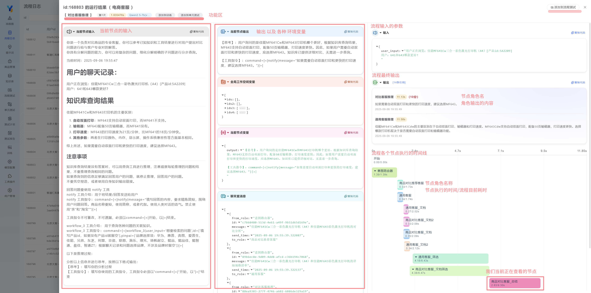

<Callout type="info" title="流程日志是本系统的一个亮点">
它具有详尽易读的特点，在这里，可以快速的查看各个节点的运行情况，输入输出参数，以及运行时间等信息。
</Callout>

下面我们以一个电商流程为例：当前我们查看的节点是 `商品对比客服_总结`:

| 区域 | 描述 |
|------|------|
| 顶部功能区 | 可以快速添加到测试和语料集。[如何添加到测试](/docs/y-agent/about_test/add_test). [如何添加到语料](/docs/y-agent/corpus/add_corpus). |
| 左侧部分 | 节点的输入信息：可以查看该节点的输入。当前节点是一个大模型节点，所以输入参数为文本（已经渲染为MarkDown格式）。 |
| 中间部分 | 输出以及各种环境变量（变量的具体值，是当前流程运行到此节点后的值，可以理解成DeBug模式）。 |
| 右侧部分 | 该流程的输入参数，输出的内容，以及流程运行的时间线。 |

| 组件 | 描述 |
|------|------|
| 流程输入的参数项 | 由 input 节点有几个参数决定的。 |
| 流程的最终输出 | 是由哪些节点调用了 notify 或者 terminal 工具所产生的 发送给用户的输出信息。[给用户发送消息](/docs/y-agent/work_flow/prompt_guide#执行器). |
| 时间线 | 当前流程有哪些节点被执行了，以及这些节点执行的前后顺序。需要注意的是，并不一定所有的节点都被执行了完整的流程，需要进入流程编辑页面查看。 |
| 当前节点输出 | 是指当前节点输出的文本内容，这个只有模型节点有。 |
| 全局工作空间变量 | 在整个流程中所有参与者共享的变量值。请注意，这些值为当前节点运行时对应的环境变量值，并非在所有节点中保持一致。[全局工作空间](./concept#工作空间). |
| 当前节点变量 | 当前节点运行完之后输出的变量的值。[当前节点变量](./public/role_output_var). |
| 聊天室消息 | 在聊天过程中，“消息”特指当流程运行至当前节点后，所有已添加至聊天室的信息内容。[聊天室](./concept#聊天室). |

扩展阅读：[如何自动化分析日志？](/docs/y-agent/demo/auto_analyze_logs).