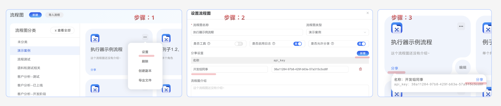

## 设置分享权限


分享设置-名称：不能为空，自定义一个名称，用作识别使用者的来源。

api_key：无论是网页端使用还是WebAPI调用，都需要API_KEY作为密钥。

可以设置多个分享，用来识别使用者的来源。在流程日志的来源中可以查看每个分析的使用情况。

通过以下操作，可以将链接复制到剪贴板，方便别人访问。


### 通过网页使用流程

直接将链接发送给别人，他人就可以通过网页访问。

### 通过代码调用流程

也可以通过代码方式调用流程的 WebApi：

<Tabs items={["Python", "Java", 'C#', 'JS']}>

    <Tab value='Python'>

        ```python
import requests
import json

# 替换复制出来的 URL
url = "http://host:port/api/workflow/shareinfo/run"  

payload = {
    "id":流程id,
    "inputs":json.dumps({"user_input":user_input,"其他参数":xxxx},ensure_ascii=False),
    "api_key":"分享的apikey"
    # 按照实际流程的参数进行替换
}
headers = {
    "Content-Type": "application/json",
}

try:
    response = requests.post(url, json=payload, headers=headers)
    response.raise_for_status()  # 检查HTTP错误
    
    # 解析JSON响应
    result = response.json()

    # 检查响应结构
if "output" in result and len(result["output"]) > 0:
    return result["output"][0]
else:
    print("响应中缺少输出数据")
    return None
    
except requests.exceptions.RequestException as e:
    print(f"请求出错: {e}")
    return None
except json.JSONDecodeError as e:
    print(f"JSON解析错误: {e}")
    return None
except KeyError as e:
    print(f"响应中缺少必要字段: {e}")
    return None

        ```

    </Tab>

    <Tab value='Java'>
```java
import java.io.*;
import java.net.HttpURLConnection;
import java.net.URL;
import java.nio.charset.StandardCharsets;

public class FlowShareClient {
    public static String callFlowShare(String userInput, String xxxx) {
        String url = "http://host:port/flowshare?id=116&api_key=";
        
        try {
            URL obj = new URL(url);
            HttpURLConnection con = (HttpURLConnection) obj.openConnection();
            con.setRequestMethod("POST");
            con.setRequestProperty("Content-Type", "application/json");
            con.setDoOutput(true);

            // 创建Payload
            String payload = String.format("{\"id\":%d,\"inputs\":%s}",
                116,
                String.format("{\"user_input\":\"%s\",\"xxxxx\":\"%s\"}", userInput, xxxx)
            );

            // 发送请求
            try (OutputStream os = con.getOutputStream()) {
                byte[] input = payload.getBytes(StandardCharsets.UTF_8);
                os.write(input, 0, input.length);
            }

            // 获取响应
            int responseCode = con.getResponseCode();
            if (responseCode != 200) {
                throw new RuntimeException("HTTP error: " + responseCode);
            }

            try (BufferedReader br = new BufferedReader(
                new InputStreamReader(con.getInputStream(), StandardCharsets.UTF_8))) {
                
                StringBuilder response = new StringBuilder();
                String responseLine;
                while ((responseLine = br.readLine()) != null) {
                    response.append(responseLine.trim());
                }
                
                // 解析JSON响应
                JsonObject jsonResponse = JsonParser.parseString(response.toString()).getAsJsonObject();
                return jsonResponse.getAsJsonArray("output").get(0).getAsString();
            }
        } catch (Exception e) {
            e.printStackTrace();
            return null;
        }
    }
}
```


    </Tab>
    <Tab value='C#'>
```csharp
using System;
using System.Net.Http;
using System.Text;
using System.Text.Json;
using System.Threading.Tasks;

public class FlowShareClient
{
    private static readonly HttpClient client = new HttpClient();
    
    public static async Task<string> CallFlowShareAsync(string userInput, string xxxx)
    {
        string url = "http://host:port/flowshare?id=116&api_key=";
        
        try
        {
            var payload = new
            {
                id = 116,
                inputs = new
                {
                    user_input = userInput,
                    xxxxx = xxxx
                }
            };
            
            var content = new StringContent(
                JsonSerializer.Serialize(payload),
                Encoding.UTF8,
                "application/json"
            );

            HttpResponseMessage response = await client.PostAsync(url, content);
            response.EnsureSuccessStatusCode();
            
            string responseBody = await response.Content.ReadAsStringAsync();
            using JsonDocument doc = JsonDocument.Parse(responseBody);
            return doc.RootElement.GetProperty("output")[0].GetString();
        }
        catch (Exception e)
        {
            Console.WriteLine(e.Message);
            return null;
        }
    }
}
```

    </Tab>
    <Tab value='JS'>

```js
async function callFlowShare(userInput, xxxx) {
    const url = 'http://host:port/flowshare?id=116&api_key=';
    
    try {
        const payload = {
            id: 116,
            inputs: JSON.stringify({ user_input: userInput, xxxxx: xxxx })
        };

        const response = await fetch(url, {
            method: 'POST',
            headers: {
                'Content-Type': 'application/json'
            },
            body: JSON.stringify(payload)
        });

        if (!response.ok) {
            throw new Error(`HTTP error! status: ${response.status}`);
        }

        const data = await response.json();
        return data.output[0];
    } catch (error) {
        console.error('Error:', error);
        return null;
    }
}
```
    </Tab>


</Tabs>