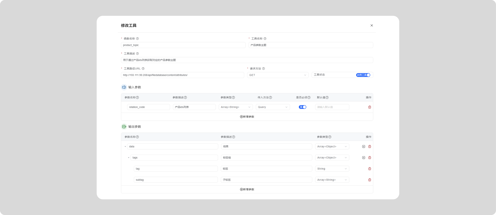

<Accordions title="内置工具">

<Accordion title="知识库查询">

知识库查询工具用于查询知识库中的文档。

配置方法：

queries参数：提取要查询的问题列表 格式["问题1", "问题2"]，起作用的机制是：根据输入问题，进行向量库匹配。
tags参数：指定要查询的标签列表，即知识库设置的标签 格式["标签1", "标签2"]，起作用的机制是：如果填写标签，则只查询包含这些标签的 和 没有任何标签的文档。

ids参数：指定要查询的EXCEL参数库的 唯一编码 列表 格式["ID1", "ID2"]起作用的机制是： 只针对EXCEL参数库起作用
> 注意：填写ids参数，是一个额外召回的机制，会额外召回指定ID的文档，不会对输入问题进行向量匹配。

文档知识库
文档知识库召回文本数
EXCEL参数库
EXCEL参数库召回文本数

元数据过滤：EXCEL参数库的元数据过滤条件，用于过滤参数库中符合条件的元数据。
输出格式：JSON，用于后续流程解析。MarkDown，通常直接用于输出给模型或者用户。
评分过滤值：评分过滤值，用于过滤掉评分低于该值的结果。

</Accordion>

<Accordion title="计算器">

计算器工具用于进行简单计算，可以填写数学表达式。

配置方法：

expression参数：计算表达式 格式"1+2"

计算器工具，其实是对NumExpr的简单封装，具体功能参考 [NumExpr的文档](https://numexpr.readthedocs.io/en/latest/user_guide.html)。

NumExpr 支持以下运算符和函数：

逻辑运算符：&, |, ~

比较运算符：`<`, `<=`, `==`, `!=`, `>=`, `>`

一元算术运算符：`-`

二进制算术运算符：`+`, `-`, `*`, `/`, `**`, `%`, `<<`, `>>`

支持的函数：where, sin, cos, tan, arcsin, arccos, arctan, arctan2, sinh, cosh, tanh, arcsinh, arccosh, arctanh, log, log10, log1p, exp, expm1, sqrt, abs, conj, real, imag, complex, contains

</Accordion>

<Accordion title="流程日志查询" id="flow_node_logs">
工具名称：		
flow_node_logs 流程日志查询

<include>../public/query_flow_logs.mdx</include>

</Accordion>
<Accordion title="添加单元测试">
工具名称：		
unit_test_add	添加单元测试	

功能描述：用于把指定的流程运行日志添加到单元测试中。

使用方法：
| 参数名 | 说明 | 参考值 |
|--------|--------|------|
| unit_cate_id | 手工建立好的单元测试的分类id | - |
| node_log_id | 要添加单元测试的节点日志id，从查询流程日志中可以获取到 | - |
| test_note | 测试备注信息 | 注意以下两点：1、回答是否前后矛盾。2、是否存在歧义。 |

添加成功后，工具会返回类似结果：
`{"result":"success"} `

</Accordion>
<Accordion title="添加语料">
工具名称：		
train_case_add	添加训练语料

使用方法：
| 参数名 | 说明 | 参考值 |
|--------|--------|------|
| train_cate_id | 手工建立好的语料分类id | 在语料菜单，点击分类，页面左上角显示当前分类id。|
| input_content | 输入文本 | 对应每条语料的输入 |
| output_contet | 输出文本 | 对应每条语料的输出 |
| feature| 输出文本 | 语料特征文本 |
| node_log_id| 输出文本 | 训练的关联节点日志id，非必填 |
| test_case_id| 输出文本 | 要添加训练的关联的单元测试的Id，非必填 |

输出： `{"result":"success"} `

</Accordion>

<Accordion title="知识库文档添加">
工具名称：		
knowledge_add	向指定知识库动态添加文档知识

使用方法：
| 参数名 | 说明 | 参考值 |
|--------|--------|------|
| knowledgebase_id | 文档所属知识库id | 点击分类，页面左上角显示知识库id 。|
| category_id | 文档所属分类id | 点击分类，页面左上角显示当前分类id。|
| title | 文档的标题 | |
| content | 文档的内容 | |

输出： `{"result":"success"} `
</Accordion>
<Accordion title="知识库内容追加">

knowledge_append	向指定文档中追加内容

| 参数名 | 说明 | 参考值 |
|--------|--------|------|
| doucument_id | 文档id | 文档列表中的id 。|
| content | 文档的内容 | |
| test_note | 测试备注 | 可空|

输出： `{"result":"success"} `

</Accordion>

<Accordion title="如何显示引用文档">

关于引用文档的规则，我们规定必须在Jinja模板中使用`{{sys.get_documents_text(["id1","id2"])}}`或者`{{sys.get_documents_json(["id1","id2"])}}`指定文档id替换展示文档内容的才会出现在引用中。

为什么要这样做？

原因：知识库查询工具有可能设置的召回文档数量比较多，如果直接把这么多文章添加到引用，失去了查看引用的价值【太多无法分辨真实引用】。

我们建议如何做：

我们建议通过三个节点实现引用和回答问题，例如：

1、知识库查询工具粗筛：这个节点负责使用工具查询出N个相关文章，可能包含很多无关文章。

2、大模型精筛文档：这个节点负责，通过分批处理问题与文章的相关性让大模型精确筛选是否相关，相关的会把文章id存储到一个工作空间变量中，比如a变量。

3、大模型回答并添加系统引用：这个节点负责回答用户问题，通过使用第2步中筛选结果替换最终筛选后的文章并添加到引用，如`{{sys.get_documents_text(sys.space.a)}}`

通过以上三个步骤，既提高大模型回答的准确性，又解决了实际查看引用的问题。
</Accordion>
</Accordions>

<Accordions>
<Accordion title="如何直接调用系统API">
<include>../public/sys_webapi.mdx</include>

</Accordion>
</Accordions>
