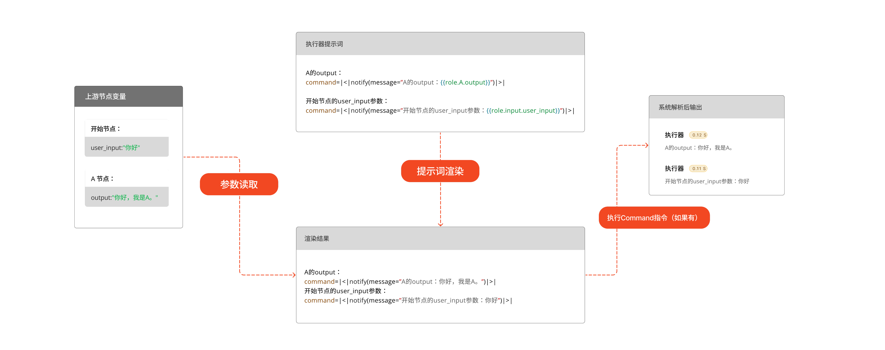

## 什么是执行器节点？
执行器是一个允许用户通过jinja模板语言，来手动出发系统函数的地方。
通过对jinja模板的合理设计，用户可调用相应的系统函数，从而完成预设的固定执行任务。

执行器的工作原理是，直接将jinja模进行渲染，然后解析结果，调用相应的系统函数。

示意图：



## 执行器节点配置

<include>../public/sys_function.mdx</include>
## 执行器使用的案例：
<Accordions>
  <Accordion title="向用户输出消息">
    ```python
    command=|<|notify(message="你好，欢迎使用！")|>|
    # 或者 在message中编写模板引用其他节点信息
    command=|<|notify(message="开始节点的user_input参数：{{role.input.user_input}}")|>|
    # 也可以使用 terminate 函数
    command=|<|terminate(message="你好，本消息发送后，工作流将终止（正在执行的节点会执行完毕，未执行的节点将被取消）")|>|
    ```
    
  </Accordion>
  <Accordion title="直接写入工作空间变量">
    ```python
    # 假设工作空间存在变量 ids
    command=|<|write_var(ids=['id1','id2'])|>| # 写变量
    ```
  </Accordion>
  <Accordion title="根据固定代码逻辑，执行系统函数">
   ```python
   # 此处为Jinja模板代码
       
    command=|<|write_var(ids=['id1','id2'])|>| # 写变量
    
    command=|<|notify(message="你好，欢迎使用！")|>| # 通知用户
    
    ```
  </Accordion>
  <Accordion title="通过代码逻辑，选择下游角色节点">
    ```python
    # 假设本节点后存在 角色1 和 角色2 两个节点
    command=|<|assignment(next_roles=[{"role":"角色1","message":"你负责回答用户问题"}])|>|
    ```
  </Accordion>
</Accordions>