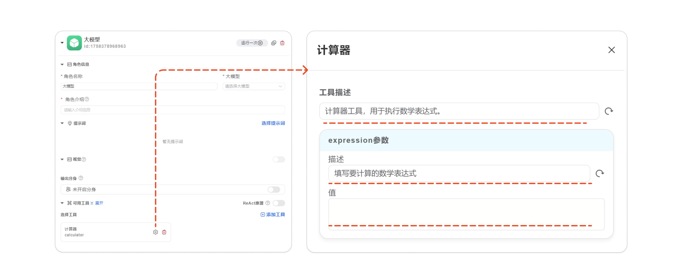
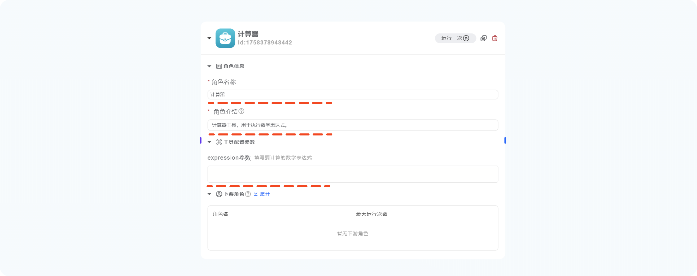

# 工具参数配置
> 工具分为：内置工具、流程工具、插件工具，无论使用哪种工具，配置参数的使用方法基本一致。

下面使用计算器工具为例：

## 将工具作为模型的可用工具


为模型添加一个工具，点击工具右下的 设置 图标。

打开工具参数配置界面。

当工具作为模型工具的时候，可以看到有三种可编辑参数：

- 工具描述
- 参数描述
- 参数值

工具描述：描述工具的功能，用于帮助模型正确的选择工具。

参数描述：描述参数的填写说明，帮助模型正确的填写参数。

参数值：此处留空的话，表示模型填写。不留空的话，将使用人工填写的值。

### 填写参数值的具体说明

1. 留空：代表模型填写。
2. 填写固定值：工具将固定次参数的值，流程运行的时候，将不会改变，模型也不会填写此参数。
3. Jinja模板：除了固定值之外，还可以使用Jinja模板，工具将使用Jinja模板自动生成参数值。
例如：
```python
# 使用开始节点的用户输入作为参数值
{{role.input.user_input}}

# 使用更复杂的表达式

1

0

```

## 将工具作为节点使用


直接拖拽一个工具到画布上。

当工具作为节点的时候，可以看到有三种可编辑参数：

- 角色名称：工具作为节点后，每个工具就是一个角色，名称就是这个角色的名称。
- 角色介绍：用来描述该角色的职责，帮助前面的节点正确选择该角色。（如果前面开启了自动选择角色）
- 参数值：填写方法和上面的类似，不再赘述。

> 注意：本系统内，节点就是角色，角色就是节点。