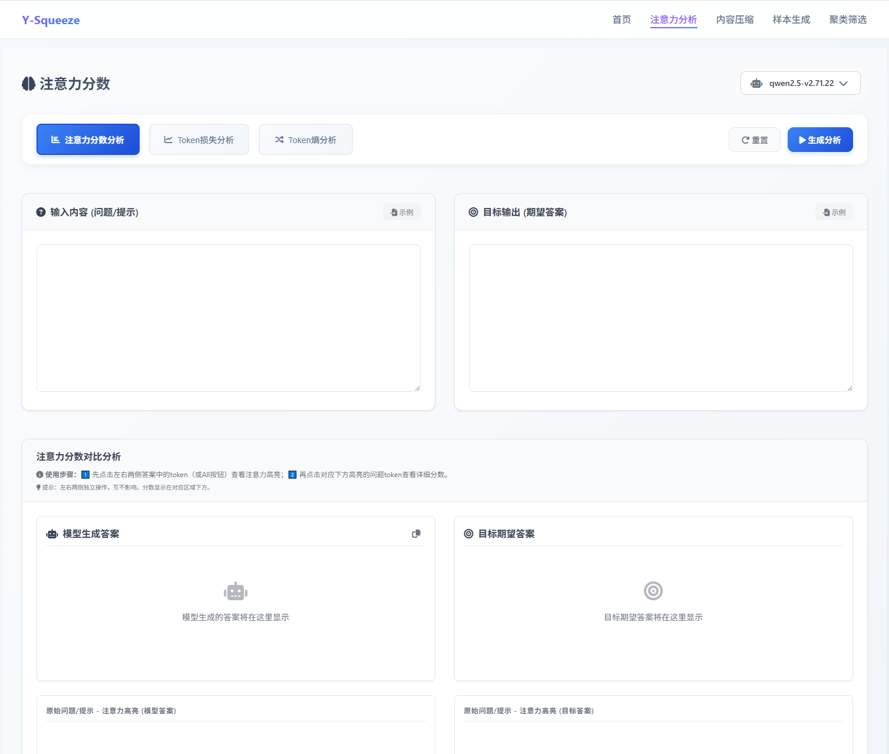
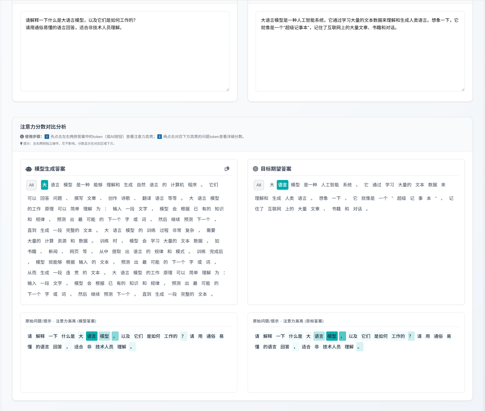

## 功能介绍
注意力分析可以显示模型在生成回答时，对输入文本的不同部分给予了多少"关注度"。通过颜色深浅和交互点击，您可以直观地看到模型的"思考过程"。

## 分析流程

### 模型准备

- 从模型列表中选择要研究的具体模型
- 确保所选模型与您的研究目标一致
- 不同模型的注意力分配机制存在显著差异

### 输入对比数据

<Tabs defaultValue="setup" className="w-full">
<TabsList className="grid w-full grid-cols-2">
<TabsTrigger value="setup">设置分析对象</TabsTrigger>
<TabsTrigger value="purpose">分析目的</TabsTrigger>
</TabsList>

<TabsContent value="setup">
- **输入问题**：研究对象的提示词或问题
- **期望输出**：标准答案或期望的模型回应
</TabsContent>

<TabsContent value="purpose">
通过对比分析模型注意力分配的合理性，识别模型在处理特定任务时的关注重点。
</TabsContent>
</Tabs>

### 注意力分配解读

<Cards>
<Card title="双栏对比显示" description="实际输出与期望输出的注意力分配对比" />
<Card title="交互式分析" description="点击任意词汇查看其注意力权重分布" />
<Card title="内部状态可视化" description="直观展示模型在处理不同token时的注意力集中程度" />
</Cards>

> 此功能主要用于研究模型内部运行机制，帮助理解模型在处理特定任务时的注意力分配策略。
## 结果含义

<Tabs defaultValue="colors" className="w-full">
<TabsList className="grid w-full grid-cols-2">
<TabsTrigger value="colors">颜色含义</TabsTrigger>
<TabsTrigger value="interpretation">如何解读</TabsTrigger>
</TabsList>

<TabsContent value="colors">
- **深色区域**：模型重点关注的内容
- **浅色区域**：模型较少关注的内容  
- **无色区域**：模型基本忽略的内容
</TabsContent>

<TabsContent value="interpretation">
- 点击输出文字时，输入文本的高亮显示了模型在生成该词时主要参考了哪些信息
- 对比左右两栏，可以看出模型的关注点与期望是否一致
- 如果重要信息没有被高亮，说明模型可能没有充分理解
</TabsContent>
</Tabs>
## 使用效果

<Cards>
<Card title="理解模型行为" description="看到模型如何'阅读'和'理解'您的输入" />
<Card title="优化提示词" description="发现哪些词语或句子没有得到应有的关注" />
<Card title="改进输入" description="调整问题的表达方式，让模型更好地理解" />
<Card title="验证效果" description="确认模型是否关注了您认为重要的信息" />
</Cards>

<Callout type="info" title="使用提示">
注意力分析最适合用于理解和优化模型的理解过程。当模型回答不理想时，可以通过注意力分析找到问题所在。
</Callout>

