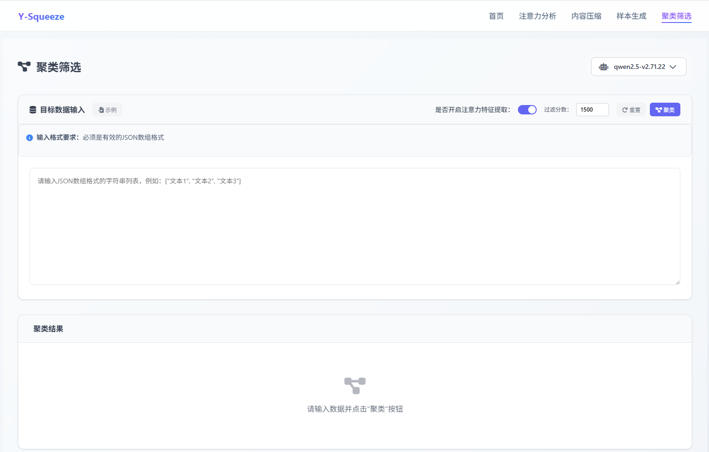
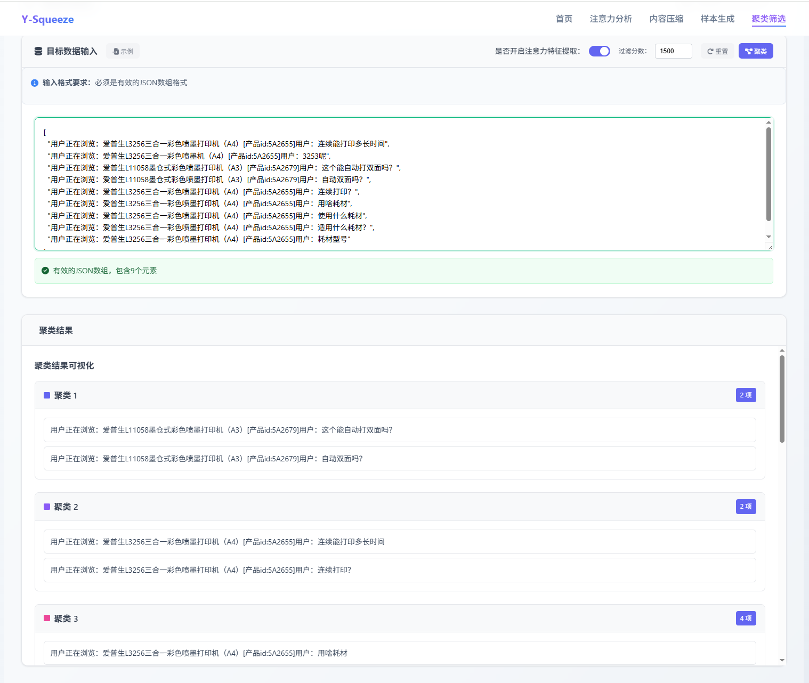

## 功能介绍

聚类筛选通过分析文本的相似性，自动将相似的内容分到同一组中。支持灵活的参数调节，可以控制分组的严格程度。

## 输入要求

### 数据格式

<Callout type="warning" title="输入格式要求">
必须输入**JSON数组格式**的文本数据
</Callout>

## 参数设置

### 注意力特征提取
- **开启**（推荐）：更准确理解文本语义，适合复杂文本
- **关闭**：处理速度更快，适合简单分类

### 过滤分数
- **取值范围**：0-3000
- **默认值**：1500
- **作用**：控制分组严格程度

| 分数范围 | 分组效果 | 适用场景 |
|----------|----------|----------|
| 0-800 | 分组较多，要求较松 | 需要细致分类 |
| 800-2000 | 平衡效果，推荐设置 | 一般使用 |
| 2000-3000 | 分组较少，要求严格 | 只要高相似度的分组 |

## 特征分析

### K-means聚类算法应用

<Callout type="warn">
通常K-means聚类的效果不是很理想，但本功能通过特征提取优化了分组效果。
</Callout>

### 模型一致性要求

<Cards>
<Card title="模型匹配" description="提取特征使用的模型需要与训练模型保持一致" />
<Card title="语料认知差异" description="模型对语料分类的判断通常与人类认知存在差异" />
<Card title="特征表示" description="相同模型下的特征提取能更好地反映训练时的语料理解" />
</Cards>

### 数据预处理

<Tabs defaultValue="format" className="w-full">
<TabsList className="grid w-full grid-cols-2">
<TabsTrigger value="format">输入格式要求</TabsTrigger>
<TabsTrigger value="quality">质量控制</TabsTrigger>
</TabsList>

<TabsContent value="format">
- 必须使用JSON数组格式
- 系统提供实时格式验证
- 可使用示例数据快速体验功能
</TabsContent>

<TabsContent value="quality">
- 确保文本内容的完整性和一致性
- 避免过短或过长的文本影响聚类效果
- 保持同批次文本的主题相关性
</TabsContent>
</Tabs>

### 聚类配置

<Accordions>
<Accordion title="特征提取策略">
- **注意力特征提取**：建议启用，能够更准确理解文本语义
- **处理速度权衡**：关闭时速度更快，但准确性可能下降
</Accordion>

<Accordion title="分组严格度控制">
- **过滤分数设置**：调整分组的严格程度（默认1500）
- **效果预期**：分数越高分组越严格，相似度要求越高
</Accordion>
</Accordions>

### 结果解读

- **分组展示**：按相似度将文本归类到不同组别
- **内容详情**：展示每个组别包含的具体文本内容

> 注意：聚类结果基于模型的特征理解，可能与人类的分类直觉存在差异。

## 结果含义

<Tabs defaultValue="logic" className="w-full">
<TabsList className="grid w-full grid-cols-2">
<TabsTrigger value="logic">分组逻辑</TabsTrigger>
<TabsTrigger value="similarity">相似度判断</TabsTrigger>
</TabsList>

<TabsContent value="logic">
- **同一组内**：文本内容相似，主题相关
- **不同组间**：文本差异较大，主题不同
- **分组数量**：取决于文本相似程度和过滤分数设置
</TabsContent>

<TabsContent value="similarity">
- 系统会分析文本的语义、主题、表达方式
- 相似的内容会被自动归类
- 可以发现您可能没有注意到的相似性
</TabsContent>
</Tabs>

## 使用效果

<Cards>
<Card title="整理文档" description="将大量文档按主题自动分类" />
<Card title="发现相似内容" description="找出重复或高度相似的文本" />
<Card title="数据预处理" description="为后续分析整理数据" />
<Card title="内容分析" description="理解文本集合的主题分布" />
</Cards>

## 使用技巧

<Accordions>
<Accordion title="输入优化">
- **数量适中**：建议10-100个文本，效果最佳
- **质量优先**：使用清晰、规范的文本
- **长度统一**：尽量保持文本长度相近
</Accordion>

<Accordion title="参数调节">
- **分组太多**：提高过滤分数（1800-2500）
- **分组太少**：降低过滤分数（800-1200）
- **效果不佳**：尝试开启/关闭注意力特征提取
</Accordion>
</Accordions>

<Callout type="info" title="使用提示">
聚类筛选适合处理文档分类、内容去重、数据整理等场景。建议先用默认参数尝试，再根据分组效果调整。
</Callout>

