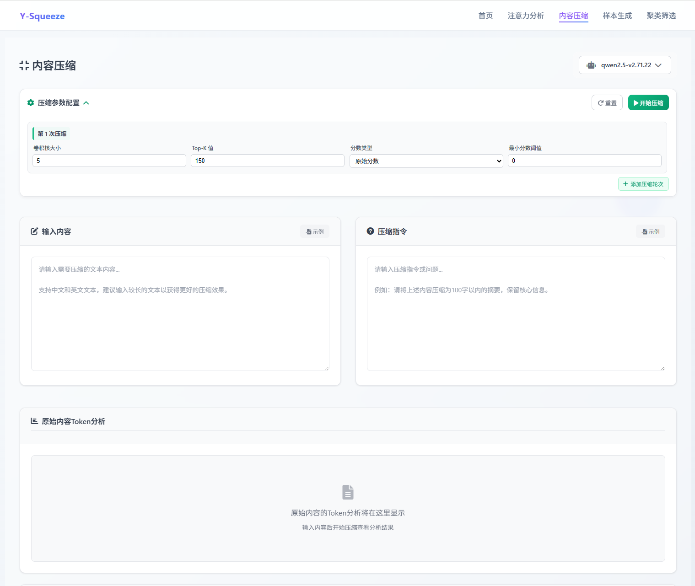
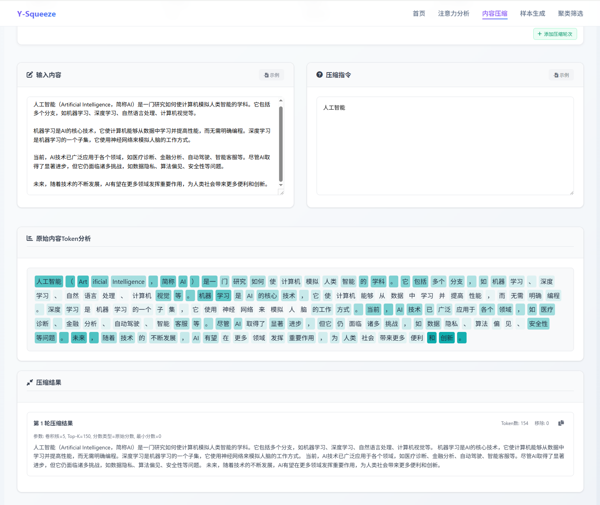

## 功能介绍

内容压缩通过分析文本中每个词语的重要程度，自动保留关键信息，去除冗余内容。支持多轮压缩，可以逐步精简文本直到满意为止。

<Callout type="warning" title="实验性功能">
此功能为实验性质，效果仍在持续优化中。
</Callout>

## 压缩参数

每个压缩轮次可以设置以下参数：

| 参数 | 作用 | 建议 |
|------|------|------|
| **卷积核大小** (1-10) | 控制分析范围 | 短文用小值，长文用大值 |
| **Top-K值** (1-200) | 保留词语数量 | 根据期望长度调整 |
| **分数类型** (1-2) | 计算方式 | 1=原始分数，2=分数加权放大 |
| **最小分数** (0-1) | 过滤阈值 | 0=不过滤，越高过滤越多 |

## 压缩策略

### 多轮压缩配置

<Tabs defaultValue="params" className="w-full">
<TabsList className="grid w-full grid-cols-2">
<TabsTrigger value="params">参数优化策略</TabsTrigger>
<TabsTrigger value="process">多轮次处理</TabsTrigger>
</TabsList>

<TabsContent value="params">
- **卷积核大小**：根据文本长度调整分析窗口
- **Top-K选择**：控制每轮保留的关键词汇数量  
- **分数类型**：选择计算权重的算法方式
- **过滤阈值**：设定词汇重要性的最低标准
</TabsContent>

<TabsContent value="process">
- 支持添加多个压缩轮次
- 每轮可使用不同参数配置
- 逐步精炼文本内容
</TabsContent>
</Tabs>

### 压缩执行

<Accordions>
<Accordion title="输入准备">
- **原始文本**：需要压缩的完整内容
- **压缩指令**：明确的处理要求和保留重点
</Accordion>

<Accordion title="结果分析">
- **Token级别分析**：词汇重要程度的可视化展示（颜色深浅表示权重）
- **压缩效果验证**：对比原文与压缩结果的信息保留度
- **质量评估**：验证关键信息是否被正确保留
</Accordion>
</Accordions>

> 注意：此功能仍在优化中，建议在正式应用前充分测试压缩效果。

## 结果含义

<Tabs defaultValue="token" className="w-full">
<TabsList className="grid w-full grid-cols-2">
<TabsTrigger value="token">Token分析</TabsTrigger>
<TabsTrigger value="effect">压缩效果</TabsTrigger>
</TabsList>

<TabsContent value="token">
- **深色词语**：被判定为重要，会保留
- **浅色词语**：重要性一般，可能保留
- **白色词语**：不重要，会被删除
</TabsContent>

<TabsContent value="effect">
- 显示压缩前后的token数量
- 保留文本的核心意思和关键信息
- 去除重复、冗余的表达
</TabsContent>
</Tabs>

## 使用效果

<Cards>
<Card title="快速提取要点" description="从长文中快速获取核心信息" />
<Card title="节省阅读时间" description="将冗长文档压缩为精华版本" />
<Card title="辅助写作" description="帮助精简文章，提高表达效率" />
<Card title="信息整理" description="将多个文档压缩整合" />
</Cards>

## 使用技巧

<Accordions>
<Accordion title="压缩技巧要点">
- **文本长度**：建议100字以上，太短效果不明显
- **压缩指令**：明确说明要保留什么内容
- **多轮压缩**：第一轮保守压缩，后续轮次加强
- **参数调整**：Top-K值越小压缩越激进
</Accordion>
</Accordions>

<Callout type="info" title="使用提示">
内容压缩适合处理长文档、报告、文章等。建议先用默认参数尝试，再根据效果调整。
</Callout>

