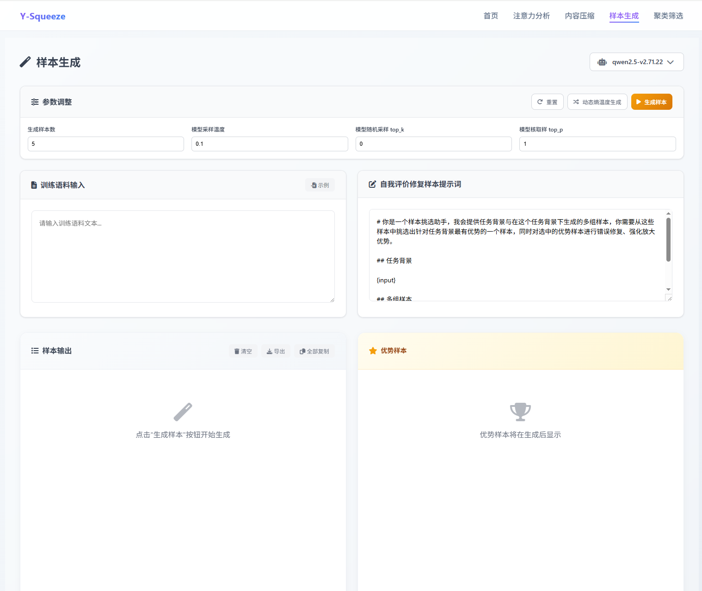
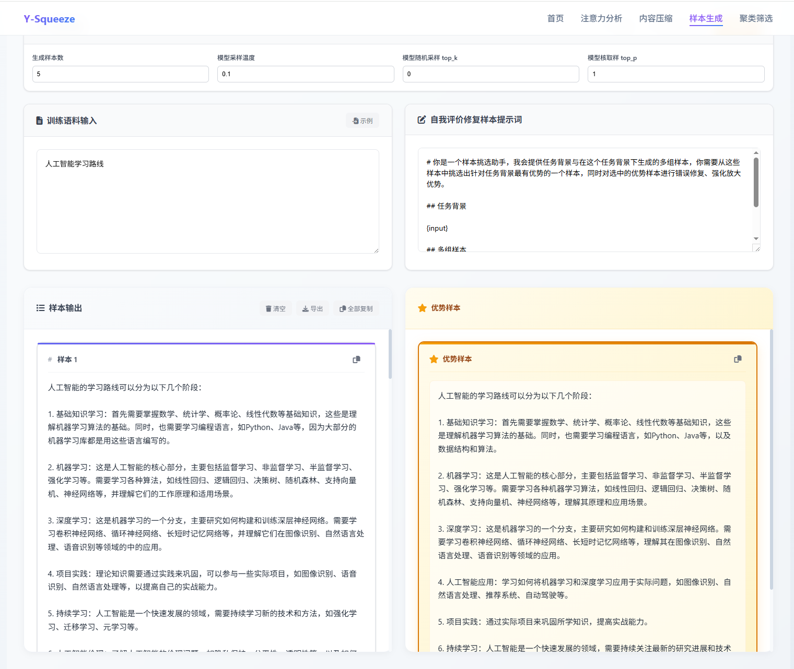

## 功能介绍

样本生成通过学习您输入的文本特点，生成多个类似的样本。支持参数调节控制生成效果，还有智能评价功能自动筛选最优样本。

<Callout type="info" title="功能说明">
此功能与Y-Trainer功能一致，集成在Y-Squeeze中是为了方便训练人员临时查看语料生成效果。
</Callout>

## 生成参数

| 参数 | 作用 | 建议 |
|------|------|------|
| **生成样本数** | 控制生成多少个样本 | 5-20个，太多质量可能下降 |
| **采样温度** | 控制创新程度 | 低值保守，高值创新 |
| **Top-K采样** | 限制词汇选择范围 | 20-50为推荐设置 |
| **Top-P采样** | 动态调整词汇选择 | 0.6-0.8平衡质量和多样性 |

## 生成配置

### 参数配置策略

<Cards>
<Card title="样本数量" description="根据实际需求设定生成批次大小" />
<Card title="采样温度" description="控制生成内容的创新程度和稳定性" />
<Card title="Top-K采样" description="限制候选词汇范围，平衡质量与多样性" />
<Card title="Top-P采样" description="动态调整词汇选择概率分布" />
</Cards>

### 双模式生成

<Tabs defaultValue="standard" className="w-full">
<TabsList className="grid w-full grid-cols-2">
<TabsTrigger value="standard">标准生成模式</TabsTrigger>
<TabsTrigger value="dynamic">动态熵温度生成</TabsTrigger>
</TabsList>

<TabsContent value="standard">
- 使用固定参数配置快速生成
- 适合批量处理和初步测试
- 生成速度快，资源消耗低
</TabsContent>

<TabsContent value="dynamic">
- 智能调节采样参数
- 根据上下文动态优化生成策略
- 质量更高但计算时间更长
</TabsContent>
</Tabs>

### 语料输入与评估

<Accordions>
<Accordion title="输入要求">
- **训练语料**：提供高质量示例文本（建议100-500字）
- **评价标准**：设置自动质量筛选规则
</Accordion>

<Accordion title="结果分析">
- **双栏展示**：左侧显示所有生成样本，右侧展示筛选后的优质样本
- **质量自动评分**：系统对生成内容的综合评估
- **批量导出支持**：便于将生成结果导入训练流程
</Accordion>
</Accordions>

> 此功能便于训练人员快速预览语料生成效果，为正式训练提供参考。

## 结果含义

<Tabs defaultValue="quality" className="w-full">
<TabsList className="grid w-full grid-cols-2">
<TabsTrigger value="quality">样本质量</TabsTrigger>
<TabsTrigger value="generation">生成效果</TabsTrigger>
</TabsList>

<TabsContent value="quality">
- **左侧样本**：按生成顺序显示所有结果
- **右侧优势样本**：经过自动评价筛选的最佳结果
- **相似度**：生成的样本会保持与原文相似的风格和结构
</TabsContent>

<TabsContent value="generation">
- **保持风格**：学习原文的语言风格和表达习惯
- **内容相关**：生成内容与原文主题相关
- **适度创新**：在保持相似性的基础上产生新的表达
</TabsContent>
</Tabs>

## 使用效果

<Cards>
<Card title="扩充训练数据" description="生成额外的样本，便于后续在模型训练或数据准备环节使用" />
<Card title="创作灵感" description="为用户提供不同的表达方式，起到辅助写作的作用" />
<Card title="风格学习" description="模仿原文风格，生成一致性较高的文本" />
<Card title="内容变化" description="在保持主题相关的前提下，输出多样化的表述" />
</Cards>

## 生成方式

<Accordions>
<Accordion title="标准生成">
- **特点**：快速生成，使用固定参数
- **适用**：快速测试和批量生成
- **效果**：速度快，质量依赖参数设置
</Accordion>

<Accordion title="动态熵温度生成">
- **特点**：智能调节参数，自动优化
- **适用**：追求高质量结果的场景
- **效果**：质量更高，但耗时更长
</Accordion>
</Accordions>

## 使用技巧

<Accordions>
<Accordion title="生成技巧要点">
- **语料质量**：使用高质量、风格统一的训练语料
- **长度适中**：建议输入100-500字的文本
- **参数调节**：温度值越低越保守，越高越创新
- **多次尝试**：可以多次生成，选择最满意的结果
</Accordion>
</Accordions>

<Callout type="info" title="使用提示">
样本生成适合需要扩充文本数据或寻找创作灵感的场景。建议先用默认参数尝试，再根据效果调整。
</Callout>

