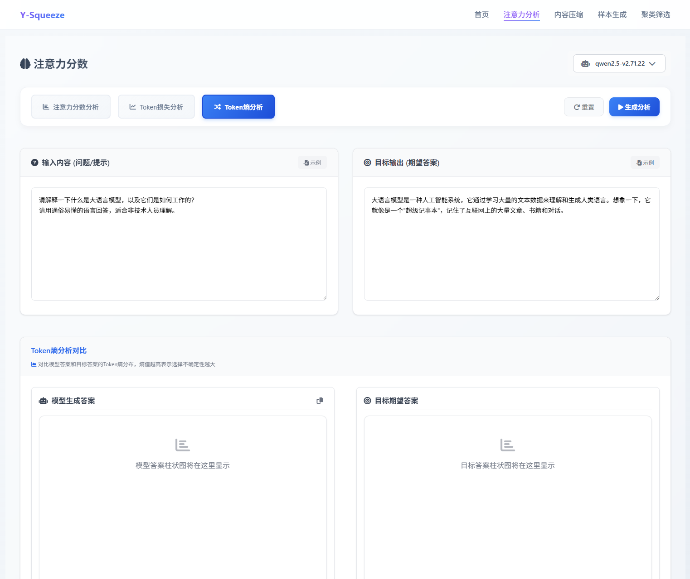
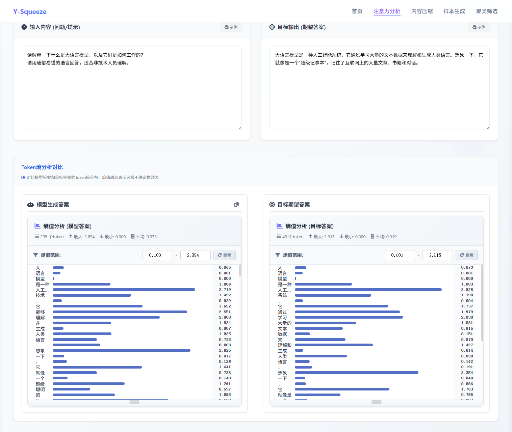

## 功能介绍

Token熵分析通过柱状图显示每个词的预测确定性。熵值越高，说明模型越不确定；熵值越低，说明模型越有把握。可以对比模型实际输出和期望输出的确定性差异。

## 熵值分析

### 分析目标

<Callout type="info">
Token熵分析是通过衡量模型输出的不确定性来判断其能力是否下降或受损的一种方法。
</Callout>

### 对比数据设置

<Tabs defaultValue="config" className="w-full">
<TabsList className="grid w-full grid-cols-2">
<TabsTrigger value="config">输入配置</TabsTrigger>
<TabsTrigger value="purpose">分析目的</TabsTrigger>
</TabsList>

<TabsContent value="config">
- **测试输入**：用于评估模型状态的问题或提示词
- **基准输出**：期望的模型回应，作为对比基准
</TabsContent>

<TabsContent value="purpose">
通过熵值变化评估模型训练后的能力状态，识别潜在的性能问题。
</TabsContent>
</Tabs>

### 不确定性评估

<Cards>
<Card title="双栏熵值图" description="左侧显示模型实际输出的不确定性，右侧显示期望输出的不确定性" />
<Card title="确定性对比" description="通过熵值高低判断模型对不同token的预测置信度" />
<Card title="能力评估" description="识别模型在训练过程中可能出现的能力退化区域" />
</Cards>

> 此分析帮助评估模型训练效果，识别可能的过拟合或欠拟合问题。

## 结果含义

- **低熵值**：模型预测确定性高，置信度强
- **中等熵值**：模型有一定不确定性，但仍可接受
- **高熵值**：模型预测不确定性大，可能存在问题
- **左右对比**：可以看出模型答案与期望答案的确定性差异

## 使用效果

<Cards>
<Card title="评估模型置信度" description="了解模型对不同词语的确定性" />
<Card title="发现不确定区域" description="找出模型犹豫不决的地方" />
<Card title="训练效果评估" description="判断模型训练是否充分" />
<Card title="过拟合检测" description="发现模型过度确定的异常情况" />
</Cards>

## 分析技巧

<Tabs defaultValue="patterns" className="w-full">
<TabsList className="grid w-full grid-cols-2">
<TabsTrigger value="patterns">熵值趋势分析</TabsTrigger>
<TabsTrigger value="anomalies">异常熵值识别</TabsTrigger>
</TabsList>

<TabsContent value="patterns">
- **递减趋势**：正常模式，随上下文增加而确定性提高
- **波动趋势**：模型预测不稳定，需要关注
- **平稳趋势**：可能存在信息利用不充分
</TabsContent>

<TabsContent value="anomalies">
- **孤立高峰**：单个词熵值异常高，可能遇到困难词汇
- **连续高熵**：多个连续词都不确定，可能是复杂概念
- **异常低熵**：可能存在过拟合现象
</TabsContent>
</Tabs>

<Callout type="info" title="使用提示">
Token熵分析适合评估模型的预测确定性和发现训练问题。与损失分析结合使用，可以更全面地了解模型表现。
</Callout>

