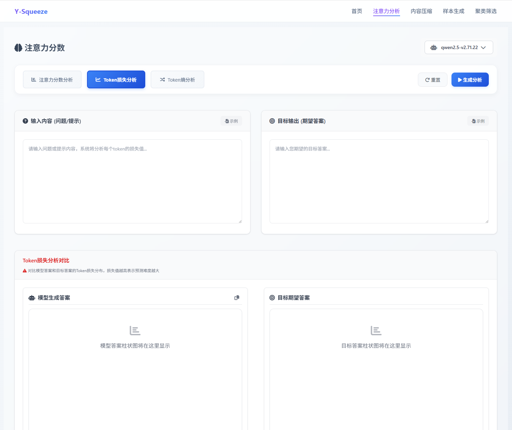
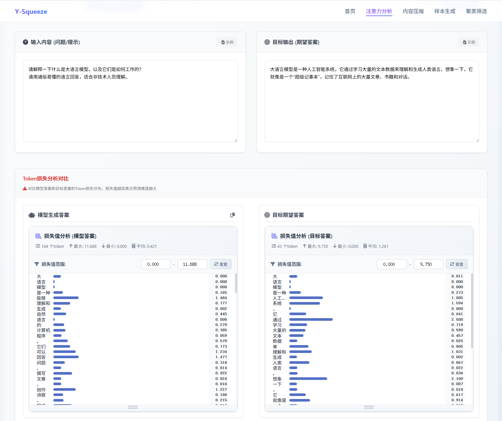

## 功能介绍

Token损失分析通过柱状图显示每个词的预测难度。损失值越高，说明模型预测该词越困难。可以对比模型实际输出和期望输出的差异。

## 损失对比分析

### 分析目标

<Callout type="info">
Token损失分析用于对比模型自身输出与期望输出的loss差异，评估模型预测能力。
</Callout>

### 对比数据设置

<Tabs defaultValue="config" className="w-full">
<TabsList className="grid w-full grid-cols-2">
<TabsTrigger value="config">输入配置</TabsTrigger>
<TabsTrigger value="purpose">分析目的</TabsTrigger>
</TabsList>

<TabsContent value="config">
- **模型输入**：提供给模型的问题或提示词
- **期望输出**：标准答案或理想的模型回应
</TabsContent>

<TabsContent value="purpose">
通过损失值对比识别模型预测的困难点，为模型优化提供数据支持。
</TabsContent>
</Tabs>

### 损失分布解读

<Cards>
<Card title="双栏柱状图" description="左侧显示模型实际输出的损失分布，右侧显示期望输出的损失分布" />
<Card title="损失值对比" description="直观展示每个token的预测困难程度差异" />
<Card title="问题识别" description="通过损失值分布找出模型理解或预测的薄弱环节" />
</Cards>

> 此分析有助于识别模型在特定任务中的预测困难点，为模型优化提供参考。

## 结果含义

- **低损失值**：模型预测该词容易，置信度高
- **中等损失值**：模型预测有一定困难，但仍可接受
- **高损失值**：模型预测该词困难，可能存在理解问题
- **左右对比**：可以看出模型答案与期望答案的预测难度差异

## 使用效果

<Cards>
<Card title="发现困难点" description="找出模型预测困难的词语或概念" />
<Card title="评估模型能力" description="了解模型在哪些方面表现不佳" />
<Card title="优化输入" description="调整问题表达，避开模型的困难点" />
<Card title="对比分析" description="比较不同回答的预测难度" />
</Cards>

## 分析技巧

<Tabs defaultValue="patterns" className="w-full">
<TabsList className="grid w-full grid-cols-2">
<TabsTrigger value="patterns">损失模式识别</TabsTrigger>
<TabsTrigger value="anomalies">异常检测</TabsTrigger>
</TabsList>

<TabsContent value="patterns">
- **递增模式**：损失随位置增加，可能是理解困难
- **波动模式**：损失不规律变化，存在特定困难点
- **平稳模式**：损失相对稳定，预测一致
</TabsContent>

<TabsContent value="anomalies">
- **孤立高峰**：单个词损失特别高，可能是生僻词
- **连续高损失**：多个连续词都困难，可能是复杂概念
- **损失断层**：损失突然变化，可能是语义转折
</TabsContent>
</Tabs>

<Callout type="info" title="使用提示">
Token损失分析适合评估模型性能和发现预测困难点。当模型回答质量不佳时，可以通过损失分析找到具体原因。
</Callout>

