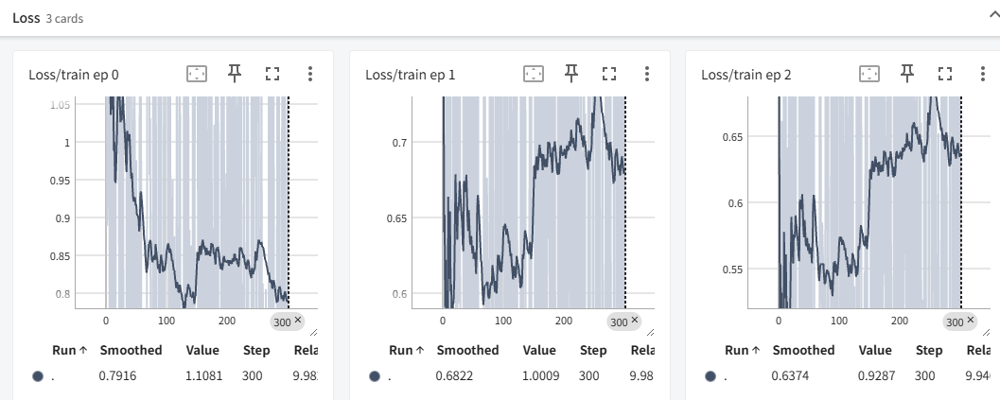

## 环境准备

### 下载源码
```shell
git clone https://github.com/yafo-ai/y-trainer.git
```
### 包依赖安装

为便捷训练，我们建议使用以下指令安装依赖包：

```shell
pip install torch peft>=0.10.0 tensorboard deepspeed==0.17.4 matplotlib
cd y-trainer
pip install -r requirements.txt
```

**注意事项：**
- 建议使用Python 3.8+版本
- 单卡环境可以不安装deepspeed
- 如需GPU支持，请安装对应版本的PyTorch
- 由于每个人的硬件环境不同，建议自行安装显卡驱动 CUDA环境和torch，请根据实际情况调整

## 准备数据

具体数据格式参考：[语料数据格式](./dataset).

## 最佳实践示例

我们建议使用以下默认参数进行训练，这些参数在我们实际训练中取得了良好效果：


### LoRA微调

单卡LoRA指令微调 (SFT)

以下为示例，具体可以参考目录：scripts/sft.sh 脚本。Windows环境下请参考sft.bat脚本。

```shell
python -m training_code.start_training \
    --model_path_to_load /root/autodl-fs/model/test_model_qwen1.5b \
    --training_type 'sft' \
    --use_NLIRG 'true' \
    --epoch 3 \
    --checkpoint_epoch '0,1' \
    --data_path example_dataset/sft_example.json \
    --output_dir outputdir \
    --use_lora 'true' \
    --batch_size 1 \
    --token_batch 10 \
    --lora_target_modules "q_proj,k_proj,v_proj,o_proj,gate_proj,up_proj,down_proj"
```

**参数说明：**
- `--use_NLIRG`: 核心功能，默认启用。启用智能训练优化算法
- `--model_path_to_load` 加载的模型目录
- `--use_lora`: 启用LoRA训练，降低显存需求
- `--token_batch 10`: 每次反向传播处理的token数量，重要参数不建议更改
- `--checkpoint_epoch '0,1'`: 在第0轮和第1轮保存检查点

[更多参数说明](./config).

### 预训练

多卡全量继续预训练 (CPT)


以下为示例，具体可以参考目录：scripts/cpt.sh 脚本。
```shell
deepspeed --master_port 29501 --include localhost:0,1 --module training_code.start_training \
    --model_path_to_load Qwen/Qwen3-8B \
    --training_type 'cpt' \
    --use_NLIRG 'true'\
    --batch_size 2 \
    --use_deepspeed 'true' \
    --pack_length 2048 \
    --data_path example_dataset/cpt_example.json \
    --output_dir outputdir \
    --epoch 3
```

**参数说明：**
- `--use_NLIRG`: 核心功能，默认启用。启用智能训练优化算法
- `--use_deepspeed`: 启用多卡并行训练
- `--pack_length 2048`: 文本打包长度，提高训练效率


## 训练场景指南

### CPT: 继续预训练

**适用场景**: 领域迁移、知识补充、模型能力扩展

**使用时机**: 
- 模型在特定领域表现不佳
- 需要为模型添加新的专业知识
- 希望提升模型在特定任务上的表现

**训练建议**:
- 使用领域相关的文本数据进行训练
- 训练轮次建议3-5轮
- 启用NLIRG算法优化训练效果

### SFT: 指令微调

**适用场景**: 问答、摘要、翻译、代码生成、角色扮演等具体任务

**使用时机**:
- 需要模型遵循特定指令格式
- 希望模型具备特定对话风格
- 需要模型完成结构化任务

**训练建议**:
- 准备高质量的指令-输出对
- 训练轮次建议2-4轮
- 启用NLIRG算法提升训练效率
- 资源有限时可使用LoRA训练

## 📊 TensorBoard 可视化支持

### 启动Tensorboard

```bash
tensorboard --logdir=/path/to/logs 
# 启动后，按照命令行提示在浏览器中访问即可实时查看训练情况
```
### 效果



## 📈 实用工具：语料排序。帮助您快速识别地低质量语料！

### 智能语料难易度评估

此工具基于模型面对语料时熵与交叉熵的整体时序差异来评估语料的难易度，帮助开发者获得难度递增的微调语料。

**应用场景**：
- 构建渐进式训练数据集
- 优化模型学习路径
- 提高训练效率和效果

### 使用示例

```bash
# 调用排序脚本，对指令微调数据按照与模型的相似度排序
# 参数说明：
#   --data_path: 原始指令微调数据 JSON 文件路径
#   --output_path: 排序后输出的 JSON 文件路径
#   --model_path: 用于推理和排序的基础模型（如 Qwen3-8B）
#   --mode: 排序策略，此处为 "similarity_rank"（曲线相似度排序）

cd ~/y-trainer

python -m training_code.utils.schedule.sort \
    --data_path example_dataset/sft_example.json \
    --output_path example_dataset/sft_example_out.json \
    --model_path Qwen3/Qwen3-8B \
    --mode "similarity_rank"
```

### 排序策略说明

- **similarity_rank**：基于曲线相似度的排序策略
- 其他排序策略可根据需求扩展
