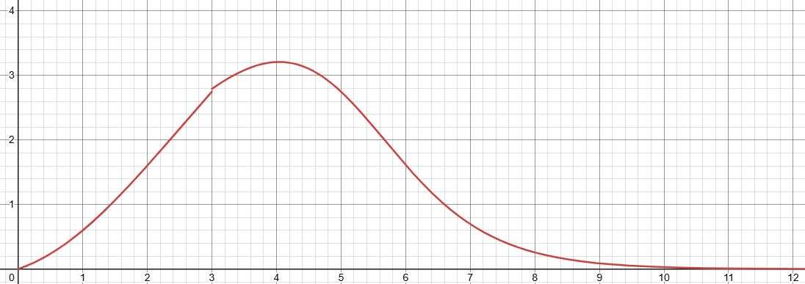

## 核心算法：基于梯度的非线性学习强度调节算法

Gradient-driven Nonlinear Learning Intensity Regulation(NLIRG)

### 算法简介

NLIRG（基于梯度的非线性学习强度调节算法）是一种智能训练优化技术。简单来说，它就像一位经验丰富的教练，能够：

- **智能识别难度**：实时判断每个训练样本对模型来说有多难
- **动态调整强度**：根据难度自动调整训练强度
- **防止过拟合**：避免模型过度记忆训练数据而失去泛化能力

通过使用NLIRG，可以让模型在训练过程中，实时监测训练样本的难易度，并根据样本的难易度，动态调整训练强度，从而实现模型训练的调优，同时又缓解了模型的过拟合。

具体的说，我们为模型训练定制了一条曲线，使用损失来衡量模型训练的难度，并根据损失曲线，动态调整训练强度。



横坐标代表Loss值，纵坐标代表梯度计算权重。

### 核心算法函数

```python
def dynamic_sigmoid_batch(losses, max_lr=1.0, x0=1.2, min_lr=5e-8, 
    k=1.7, loss_threshold=3.0, loss_deadline=15.0):
    """
    NLIRG核心算法：基于损失值的动态权重计算
    
    参数说明：
    - losses: 损失值张量
    - max_lr: 最大学习率权重 (默认: 1.0)
    - x0: 第一个sigmoid函数的中心点 (默认: 1.2)
    - min_lr: 最小学习率权重 (默认: 5e-8)
    - k: sigmoid函数的斜率 (默认: 1.7)
    - loss_threshold: 损失阈值，区分不同区间 (默认: 3.0)
    - loss_deadline: 损失上限，超过此值梯度归零 (默认: 15.0)
    
    返回：权重张量，用于调整反向传播的梯度
    """
```


### 算法原理

NLIRG算法是一种基于现有模型训练的梯度下降算法改进。我们认为，模型训练的难易度与损失值的分布密切相关，因此，我们将损失值分布曲线作为模型训练难易度的衡量标准。

着重训练对模型有较大影响的Token，可以有效缓解模型过拟合。为防任务对模型过难，我们将损失值分布曲线分为四个区间，并根据区间对应的损失值，动态调整训练强度。

此算法详细计算每一token的损失值，并根据损失值计算对应token的权重值，将损失与权重相乘得到一个最终损失值用于反向传播。


**权重计算策略：**

| 损失区间 | 策略 | 目的 | 实际效果 |
|---------|------|------|----------|
| **低损失区间** (loss ≤ 1.45) | 削减梯度 | 避免过拟合 | 防止模型过度记忆简单样本 |
| **中等损失区间** (1.45 < loss < 6.6) | 增强梯度 | 快速学习 | 重点训练对模型有挑战性的样本 |
| **中高损失区间** (6.6 < loss < 15) | 削减梯度 | 避免过拟合 | 防止模型被困难样本带偏 |
| **高损失区间** (loss ≥ 15.0) | 梯度归零 | 避免异常样本影响 | 忽略明显错误的训练样本 |


以下是动态权重$W(L)$的计算公式：

$$
W(L) =
\begin{cases}
\frac{1}{1 + e^{-k(L - x_0)}} + \epsilon & \text{if } L \le L_{\text{threshold}} \\
\frac{1}{1 + e^{L - 6.2}} + \epsilon & \text{if } L_{\text{threshold}} < L < L_{\text{deadline}} \\
0 & \text{if } L \ge L_{\text{deadline}}
\end{cases}
$$

其中 $L$ 是损失值。


#### 训练技巧：分批次的Token训练

此算法对Token损失的精确性要求较高，为保证Token的损失计算准确性，我们将Token分批次进行训练，一次只训练少量Token，保证Token的损失计算大致准确。

**为什么需要分批次训练？**
- **精度保证**：小批次训练能更精确地计算每个token的损失
- **内存优化**：避免一次性处理过多token导致显存溢出
- **梯度稳定**：小批次训练有助于梯度计算的稳定性

**实际应用**：在SFT训练中，通过`--token_batch`参数控制每次反向传播的token数量

## 训练顺序调整算法

使用此工具可根据语料训练的难易度调整指令微调语料的顺序。

### 算法原理

我们认为，模型训练的难易度与损失值、熵的走向相似度密切相关，因此，我们将损失值、熵的相似度作为模型训练难易度的衡量标准。

**核心思想**：通过分析模型对每条语料的响应模式（损失值和熵的变化），评估语料的相对难度，难易结合，合理设置学习顺序。

**数学表达**：
设对特定一条语料的损失值矩阵为$\mathbf{L}$，熵向量为$\mathbf{E}$，则此语料的相似度为：

$$
\text{similarity}(\mathbf{L}, \mathbf{E}) = \frac{\mathbf{L} \cdot \mathbf{E}}{||\mathbf{L}|| \cdot ||\mathbf{E}||}
$$

通过对语料的相似度进行排序，即可调整语料的训练顺序。

**实际应用**：
- 再训练之前排查语料问题，检查得分较低的语料是否编写错误。
- 平衡语料难易顺序，逐步训练。注意：简单的将语料从易到难进行训练，实际测试效果并不如混合进行。